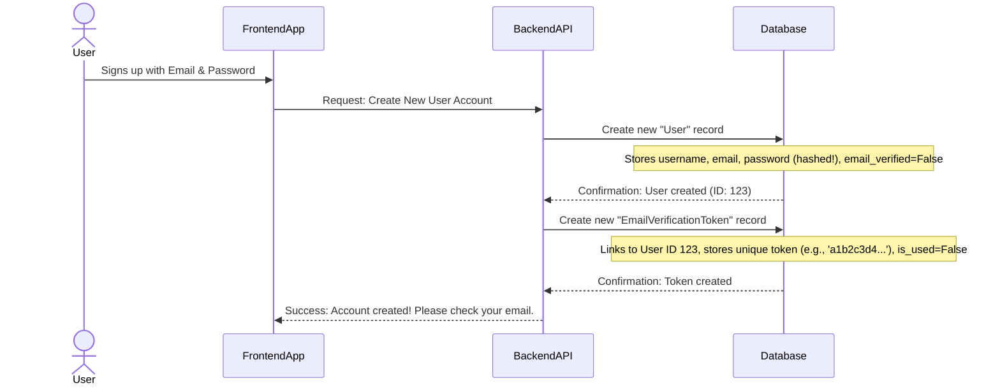
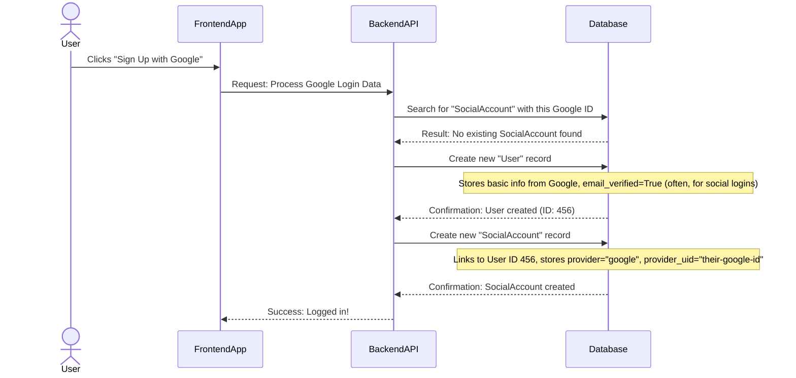

# Chapter 1: User and Account Data Models

Welcome to the very first chapter of our "Complete User Authentication" journey! Before we can build cool features like logging in or signing up, we need to understand how we're going to *store* all that important user information.

Imagine you're building a brand new library. You need a way to keep track of everyone who joins, what books they've borrowed, and how they identify themselves. Our project faces a similar challenge: how do we keep organized records for our users?

This is where "Data Models" come in. Think of data models as the **blueprints** or **forms** for storing information in our database. Just like a library needs a form for new members, we need forms for:

1.  **Basic User Information:** Their name, email, password.
2.  **Social Logins:** What if they want to log in using their Google or GitHub account? We need to link those.
3.  **Email Verification:** How do we confirm that their email address is real? We need a temporary record for that too.

These forms (our data models) act as our organized record-keeping system, meticulously detailing each user's profile and their connections.

---

### What are Data Models?

At its simplest, a **data model** is a structure that defines how your data is organized and stored. In Django (the backend framework we're using), these models are Python classes that map directly to tables in your database. Each field in the class becomes a column in the database table.

Let's break down the three essential data models we'll use for user authentication.

---

### 1. The `User` Model: Your Core Identity

Every application needs a way to identify its users. Django comes with a built-in `User` model, which is great! But often, we want to add our own specific details, like making sure an email address is unique or tracking if a user has verified their email.

Our `User` model extends Django's default one. This means it gets all the standard features (like username, password) and we can add new ones.

**Why extend?**
Imagine the basic library member form. It has fields for "Name" and "Address." But you might want to add a new field, like "Is a Premium Member?" Extending allows us to do exactly that without rewriting the whole form.

Here's a look at our `User` model:

```python
# File: backend/accounts/models.py

from django.contrib.auth.models import AbstractUser
from django.db import models

class User(AbstractUser):
    # We make email unique so no two users can share the same email.
    email = models.EmailField(unique=True)
    # This will be False when a user first signs up, then True after verification.
    email_verified = models.BooleanField(default=False)

    # This tells Django that 'email' is a required field when creating a user.
    REQUIRED_FIELDS = ["email"]
```

**What's happening here?**

*   `class User(AbstractUser):`: We're creating our own `User` model, but it "inherits" or extends `AbstractUser` from Django. This gives us all the standard user fields automatically.
*   `email = models.EmailField(unique=True)`: We're adding an `email` field. `unique=True` ensures that no two users can have the same email address in our system.
*   `email_verified = models.BooleanField(default=False)`: This is a simple true/false field. It starts as `False` when a user registers and becomes `True` once they verify their email.

---

### 2. The `SocialAccount` Model: Connecting to the World

Many users prefer the convenience of logging in with their existing social media accounts, like Google or GitHub. Our `SocialAccount` model is designed to manage these connections.

**Why do we need this?**
When you log in with Google, Google tells our application "This is User X with ID Y." We need a way to link "User X with ID Y from Google" to *our* internal `User` record. The `SocialAccount` model does exactly that.

It's like having a special section on your library form to link your student ID or work ID, so you don't always have to show your main library card.

Let's look at the `SocialAccount` model:

```python
# File: backend/accounts/models.py

from django.db import models
# ... User model defined above ...

class SocialAccount(models.Model):
    # Defines the possible social providers we support.
    PROVIDERS = (
        ("google","Google"),
        ("github","GitHub"),
        # ... other providers like Facebook, LinkedIn ...
    )
    # Links this social account to one of our internal User accounts.
    user = models.ForeignKey(User, on_delete=models.CASCADE, related_name='social_accounts')
    # Stores which provider it is (e.g., "google" or "github").
    provider = models.CharField(max_length=20, choices=PROVIDERS)
    # Stores the unique ID given by the social provider.
    provider_uid = models.CharField(max_length=255)
    # Optional: To store any extra data from the social provider.
    extra_data = models.JSONField(default=dict, blank=True)

    class Meta:
        # Ensures that a user can only have one Google account, or one GitHub account.
        unique_together = ("provider","provider_uid")
```

**What's happening here?**

*   `user = models.ForeignKey(User, ...)`: This is super important! A `ForeignKey` creates a link between `SocialAccount` and our `User` model. It means each `SocialAccount` *belongs* to a specific `User`. `on_delete=models.CASCADE` means if a `User` is deleted, all their linked `SocialAccount`s are also deleted.
*   `provider = models.CharField(max_length=20, choices=PROVIDERS)`: This stores the name of the social provider (like "google" or "github"). `choices` ensures we only pick from a predefined list.
*   `provider_uid = models.CharField(...)`: This is the unique identifier given by Google, GitHub, etc., for that specific user.
*   `unique_together = ("provider","provider_uid")`: This ensures that the combination of a `provider` and its `provider_uid` is unique. For example, you can't have two Google accounts linked with the same Google ID.

---

### 3. The `EmailVerificationToken` Model: Confirming Identities

When a user signs up with their email, we want to make sure it's a real email address they control. This is where email verification comes in. The `EmailVerificationToken` model temporarily stores a special code (token) that we send to the user's email.

**Why do we need this?**
It's like sending a postcard to a new library member's address with a secret code. They have to tell you the code to prove they live there. Once they tell you, the code is "used."

Here's the `EmailVerificationToken` model:

```python
# File: backend/accounts/models.py

from django.db import models
import uuid
from django.utils import timezone
# ... User model defined above ...

class EmailVerificationToken(models.Model):
    # Links this token to a specific User.
    user = models.ForeignKey(User, on_delete=models.CASCADE, related_name='email_tokens')
    # A unique code generated for verification, like a secret key.
    token = models.UUIDField(default=uuid.uuid4, unique=True, editable=False)
    # Records when the token was created (useful for expiration).
    created_at = models.DateTimeField(default=timezone.now)
    # Becomes True once the token has been successfully used.
    is_used = models.BooleanField(default=False)
```

**What's happening here?**

*   `user = models.ForeignKey(User, ...)`: Again, this links the token to a specific `User`.
*   `token = models.UUIDField(default=uuid.uuid4, unique=True, editable=False)`: This creates a universally unique identifier (UUID) as our token. `uuid.uuid4` generates a random, unique string. `unique=True` ensures no two tokens are the same, and `editable=False` means we don't manually change it.
*   `is_used = models.BooleanField(default=False)`: Once the user clicks the verification link with this token, we'll mark this as `True` to prevent the same token from being used again.

---

### Seeing Our Models in Action: The Admin Panel

While these models are blueprints, Django provides an easy way to see and manage the data that gets stored according to these blueprints: the Django Admin Panel. By "registering" our models, we make them visible and manageable through an accessible web interface.

This is like saying "Okay, here are our new forms. Let's make sure the library staff can easily see and update these records!"

```python
# File: backend/accounts/admin.py

from django.contrib import admin
from .models import User, SocialAccount, EmailVerificationToken

# Register the User model with the admin panel.
@admin.register(User)
class UserAdmin(admin.ModelAdmin):
    # list_display shows these fields in the admin list view.
    list_display = ("id","username","email","email_verified")

# Register the SocialAccount model.
@admin.register(SocialAccount)
class SocialAdmin(admin.ModelAdmin):
    list_display = ("id","user","provider","provider_uid")

# Register the EmailVerificationToken model.
@admin.register(EmailVerificationToken)
class EmailTokenAdmin(admin.ModelAdmin):
    list_display = ("id","user","token","is_used","created_at")
```

**What's happening here?**

*   `@admin.register(User)`: This is a "decorator" that tells Django to show our `User` model in the admin panel.
*   `list_display = (...)`: This customizes which fields are shown in the main list view for each model in the admin panel, making it easier to glance at important information.

---

### A Glimpse Under the Hood: How Data Gets Stored

Let's quickly walk through what happens with our models during typical user actions.

#### Scenario 1: User Signs Up with Email

When a user registers with an email and password, our system needs to store their basic information and then prepare for email verification.



#### Scenario 2: User Signs Up with a Social Account (e.g., Google)

When a user chooses to sign up using Google for the first time, our system needs to create both a `User` record and link it to their Google identity via a `SocialAccount`.



---

### Conclusion

In this chapter, we've laid the groundwork for our entire user authentication system by understanding the core data models:

*   **`User`**: Our main blueprint for storing essential user details and custom features like `email_verified`.
*   **`SocialAccount`**: The blueprint for linking our internal users to external social providers like Google or GitHub.
*   **`EmailVerificationToken`**: The temporary record-keeping form for ensuring email addresses are valid.

These models are the fundamental building blocks. In the next chapter, we'll see how these blueprints come to life as users actually sign up, log in, and interact with the system!

[Next Chapter: User Authentication Flow (Backend)](02_user_authentication_flow__backend__.md)

---

<sub><sup>Written by [Devesh](https://github.com/devesh111).</sup></sub> <sub><sup>**References**: [[1]](https://github.com/devesh111/Complete-User-Authentication/blob/be7caf6a301c77116064d4b37322e7e9673afa30/backend/accounts/admin.py), [[2]](https://github.com/devesh111/Complete-User-Authentication/blob/be7caf6a301c77116064d4b37322e7e9673afa30/backend/accounts/models.py)</sup></sub>