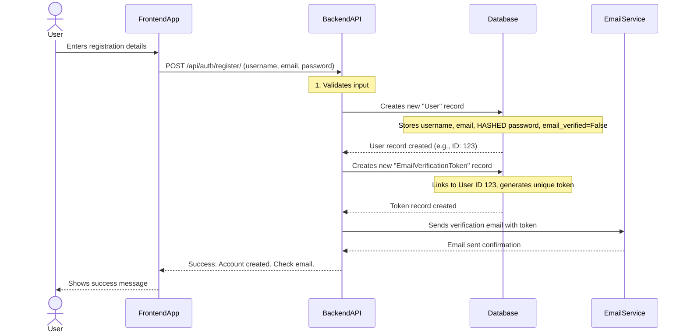
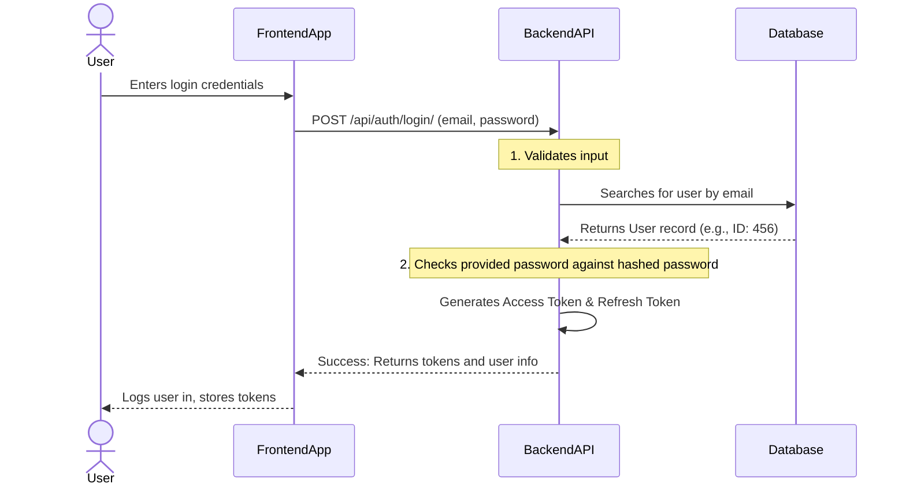
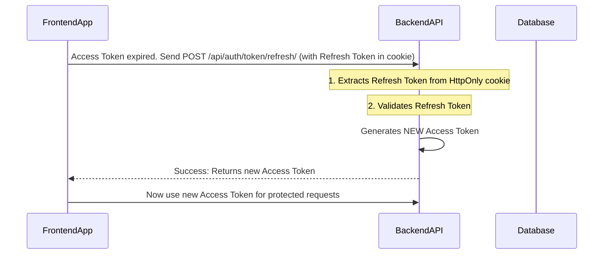
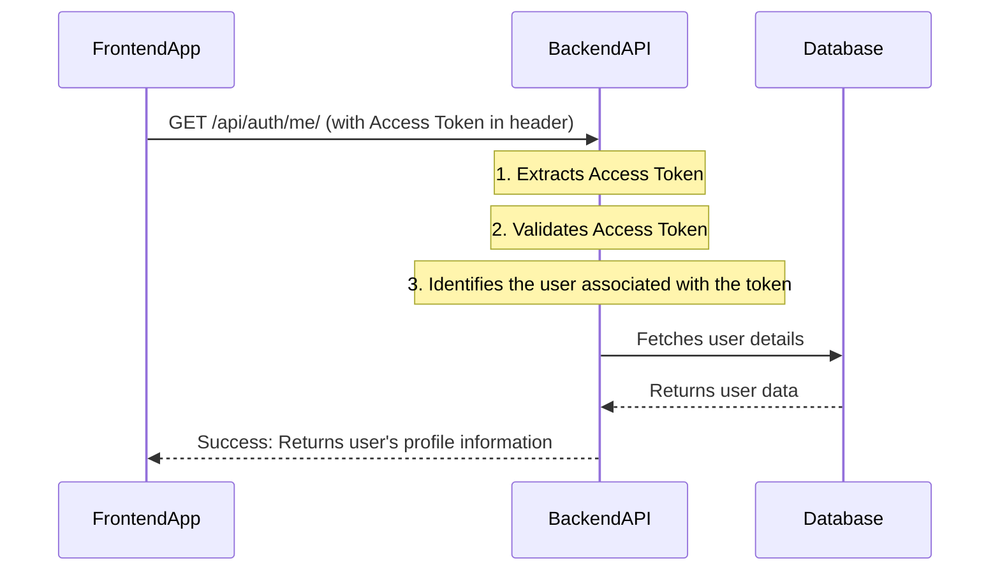
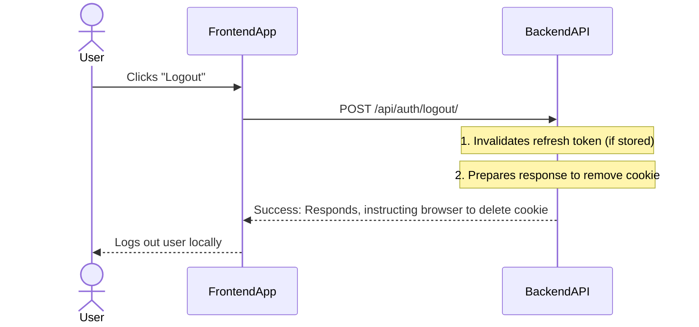

# Chapter 2: User Authentication Flow (Backend)

Welcome back, aspiring developers! In [Chapter 1: User and Account Data Models](01_user_and_account_data_models_.md), we learned about the blueprints for storing user information. We created models like `User`, `SocialAccount`, and `EmailVerificationToken`. But what good are blueprints if we don't know how to *use* them?

Imagine you've built a beautiful, secure house (your data models). Now, you need to set up the **doors, locks, and security systems** that control who gets in, how they prove their identity, and what parts of the house they can access. This is exactly what the "User Authentication Flow (Backend)" is all about!

This chapter is like designing the **central security checkpoint and concierge desk** for your application. It defines how users interact with our backend to:

*   **Register** (get a key to the house)
*   **Log In** (use their key to enter)
*   **Manage their Session** (stay inside without re-entering the key constantly)
*   **Log Out** (leave the house and secure it)
*   And even **Log in with Social Accounts** (use a special pass from Google or GitHub).

At its core, this flow ensures that only authenticated (verified) users can perform actions like viewing their profile or making changes.

---

### What Problem Does it Solve?

The main problem this flow solves is **securely identifying users and controlling their access** to our application's features. Without it, anyone could pretend to be anyone else, and sensitive data would be vulnerable.

Let's consider a central use case: **A new user wants to sign up for our application, then log in to view their profile.** This chapter will guide you through how our backend handles these steps.

---

### Key Concepts of the Authentication Flow

The backend authentication flow involves several stages, each with a specific purpose:

1.  **Registration:** The process where a new user creates an account. They provide basic information like email and a password.
2.  **Login:** Users prove their identity (e.g., by entering their email and password) to gain access to their account.
3.  **Session Management (Tokens):** Once logged in, users need a way to stay logged in without re-entering their credentials for every action. We use special "tokens" for this.
4.  **Logout:** Users explicitly end their session, removing their access.
5.  **Social Login:** Allowing users to sign up or log in using existing accounts from services like Google or GitHub.

---

### 1. Registering a User: Creating a New Account

When a user wants to join our application, they fill out a registration form. Our backend needs to receive this information, validate it, save it, and kick off the email verification process.

#### How it Works: API Endpoint for Registration

Our application uses an **API endpoint** for registration. Think of an API endpoint as a specific "door" or "URL" that our frontend (what the user sees) uses to talk to our backend.

*   **Endpoint:** `/api/auth/register/` (This is where the frontend sends registration requests)
*   **Method:** `POST` (We are *sending* data to create something new)

**Example Input (from Frontend to Backend):**

```json
{
    "username": "newuser123",
    "email": "newuser@example.com",
    "password": "StrongPassword123!"
}
```

**What the Backend Does Internally (Simplified Flow):**



**Code Snapshot: Register View (`RegisterView`)**

This is the Python code in our `views.py` file that handles the `POST` request to `/api/auth/register/`.

```python
# File: backend/accounts/views.py

from rest_framework import status
from rest_framework.response import Response
from rest_framework.views import APIView
from rest_framework.permissions import AllowAny
# ... other imports ...

class RegisterView(APIView):
    permission_classes = [AllowAny] # Anyone can register
    def post(self, request):
        # 1. Take incoming data and validate it using a serializer
        ser = RegisterSerializer(data=request.data)
        ser.is_valid(raise_exception=True) # If invalid, an error is returned
        
        # 2. Save the new user to the database (password gets hashed here)
        user = ser.save() 
        
        # 3. Create an email verification token for the new user
        token_obj = EmailVerificationToken.objects.create(user=user)
        
        # 4. Send the verification email (details in Chapter 4)
        send_verification_email(user.email, str(token_obj.token))
        
        # 5. Send a success response back to the frontend
        return Response(
            {"message": "Registered. Please verify email.", "verification_token": str(token_obj.token)}, 
            status=201 # HTTP 201 means "Created"
        )
```

**Explanation:**
*   `RegisterSerializer(data=request.data)`: This takes the data sent by the frontend (like email, password) and checks if it's valid (e.g., email format, password length). We'll look at serializers briefly below.
*   `user = ser.save()`: If valid, a new `User` record is created in the database. Importantly, the password is **hashed** (scrambled) before saving, so we never store plain passwords!
*   `EmailVerificationToken.objects.create(user=user)`: A unique token is created and linked to the new user. This is what we learned about in [Chapter 1: User and Account Data Models](01_user_and_account_data_models_.md).
*   `send_verification_email(...)`: This function (which we'll explore in [Chapter 4: Email Verification System](04_email_verification_system_.md)) sends an email with a link containing this token.
*   The backend responds with a success message.

**Code Snapshot: Register Serializer (`RegisterSerializer`)**

Serializers are like special forms that help us convert incoming JSON data into Python objects that Django can understand, and vice-versa. They also handle validation.

```python
# File: backend/accounts/serializers.py

from rest_framework import serializers
from django.contrib.auth.hashers import make_password
from .models import User # Our custom User model from Chapter 1

class RegisterSerializer(serializers.ModelSerializer):
    # This field is only for writing (when creating a user), not for reading.
    # We require a minimum password length.
    password = serializers.CharField(write_only=True, min_length=8) 

    class Meta:
        model = User # This serializer works with our User model
        fields = ("username","email","password") # Fields we accept

    # This method is automatically called when .save() is used on the serializer.
    def create(self, validated_data):
        # Before saving, hash the password for security!
        validated_data['password'] = make_password(validated_data['password'])
        # Create and return the user object
        return User.objects.create(**validated_data)
```

**Explanation:**
*   `password = serializers.CharField(...)`: Defines the `password` field, ensuring it's only used when creating/updating and has a minimum length.
*   `Meta`: Links this serializer to our `User` model and specifies which fields it should handle.
*   `create` method: This is where the magic happens for saving. `make_password` is a Django function that turns the plain password into a secure, hashed string.

---

### 2. Logging In a User: Proving Identity

After registering (and verifying their email, ideally), users can log in to access the application.

#### How it Works: API Endpoint for Login

*   **Endpoint:** `/api/auth/login/`
*   **Method:** `POST`

**Example Input:**

```json
{
    "email": "existinguser@example.com",
    "password": "StrongPassword123!"
}
```

**What the Backend Does Internally (Simplified Flow):**



**Code Snapshot: Login View (`LoginView`)**

```python
# File: backend/accounts/views.py

# ... other imports ...
from rest_framework_simplejwt.tokens import RefreshToken # For generating tokens

class LoginView(APIView):
    permission_classes = [AllowAny]
    def post(self, request):
        # 1. Validate credentials using the LoginSerializer
        ser = LoginSerializer(data=request.data)
        ser.is_valid(raise_exception=True)
        
        # 2. Get the authenticated user object from the serializer
        user = ser.validated_data['user']
        
        # 3. Generate a refresh token for the user
        refresh = RefreshToken.for_user(user)
        
        # 4. Return both the access token and refresh token
        return Response({
            'access': str(refresh.access_token), 
            'refresh': str(refresh), 
            'user': {'id': user.id, 'username': user.username, 'email': user.email, 'email_verified': user.email_verified}
        })
```

**Explanation:**
*   `LoginSerializer` handles finding the user by email and verifying the password.
*   `RefreshToken.for_user(user)`: This is a crucial step! It uses `django-rest-framework-simplejwt` to create two types of tokens: an **Access Token** and a **Refresh Token**. We'll discuss these next.

**Code Snapshot: Login Serializer (`LoginSerializer`)**

```python
# File: backend/accounts/serializers.py

from rest_framework import serializers
from django.contrib.auth import authenticate # Django's built-in password checker
from .models import User # Our custom User model

class LoginSerializer(serializers.Serializer):
    email = serializers.EmailField()
    password = serializers.CharField(write_only=True)

    # The validate method is where we check email and password.
    def validate(self, attrs):
        email = attrs.get('email')
        password = attrs.get('password')

        # Try to find the user by email first
        try:
            user = User.objects.get(email=email)
            username = user.username # authenticate needs username, but we login with email
        except User.DoesNotExist:
            raise serializers.ValidationError('Invalid credentials')

        # Use Django's authenticate function to check password
        user = authenticate(username=username, password=password) 

        if not user:
            raise serializers.ValidationError('Invalid credentials')
        
        # If successful, add the user object to the validated data
        attrs['user'] = user 
        return attrs
```

**Explanation:**
*   `authenticate(username=username, password=password)`: This powerful Django function automatically checks the provided password against the hashed password stored in the database for the given user. It handles all the complex hashing and comparison for us!

---

### 3. Session Management: Access and Refresh Tokens

Once a user logs in, they get two special "keys": an **Access Token** and a **Refresh Token**.

Imagine you get a special **ID card (Access Token)** that lets you quickly open doors in a building. It's valid for a short time (e.g., 5-15 minutes). You also get a **special voucher (Refresh Token)** that you can exchange for a *new* ID card when your old one expires. The voucher lasts longer (e.g., 2 weeks).

**How it Works:**

*   **Access Token:** Sent with almost every request to access protected data. It's short-lived for security. If it's stolen, it's only useful for a short time.
*   **Refresh Token:** Used *only* to get a new Access Token when the old one expires. It's longer-lived and stored more securely (in an HttpOnly cookie, meaning JavaScript can't touch it, which helps prevent certain attacks).

#### Refreshing the Access Token

When the Access Token expires, the frontend uses the Refresh Token to get a new one.

*   **Endpoint:** `/api/auth/token/refresh/`
*   **Method:** `POST`

**What the Backend Does Internally:**



**Code Snapshot: Cookie Token Refresh View (`CookieTokenRefreshView`)**

```python
# File: backend/accounts/views.py

from rest_framework_simplejwt.views import TokenRefreshView
from rest_framework_simplejwt.tokens import RefreshToken
from rest_framework_simplejwt.exceptions import InvalidToken
from rest_framework.response import Response # Import Response

class CookieTokenRefreshView(APIView): # Changed from TokenRefreshView for cookie handling
    def post(self, request):
        # 1. Get the refresh token from the HttpOnly cookie
        refresh_token = request.COOKIES.get("refresh_token")
        if not refresh_token:
            return Response({"detail": "No refresh token"}, status=400)

        try:
            # 2. Use simplejwt's RefreshToken to validate and get a new access token
            refresh = RefreshToken(refresh_token)
            access_token = str(refresh.access_token)
            return Response({"access": access_token})
        except Exception: # Catch any error during token refresh
            raise InvalidToken("Invalid refresh token")
```

**Explanation:**
*   `request.COOKIES.get("refresh_token")`: The backend directly reads the `refresh_token` from the cookies sent with the request.
*   `RefreshToken(refresh_token)`: This attempts to validate the refresh token and then automatically creates a new access token.

#### Accessing Protected Resources

Once a user has a valid Access Token, they can send it with requests to view their profile, update settings, or do anything else that requires them to be logged in.

*   **Endpoint:** `/api/auth/me/` (or any other protected endpoint)
*   **Method:** `GET`
*   **Input:** Access Token in the `Authorization` header (`Authorization: Bearer <ACCESS_TOKEN>`)

**What the Backend Does Internally:**



**Code Snapshot: Me View (`MeView`)**

```python
# File: backend/accounts/views.py

from rest_framework.permissions import IsAuthenticated # Only authenticated users

class MeView(APIView):
    permission_classes = [IsAuthenticated] # This ensures only logged-in users can access
    def get(self, request):
        # request.user is automatically populated by Django if the token is valid
        u = request.user 
        return Response({
            'id': u.id, 
            'username': u.username, 
            'email': u.email, 
            'email_verified': u.email_verified, 
            'providers': list(u.social_accounts.values_list('provider', flat=True))
        })
```

**Explanation:**
*   `permission_classes = [IsAuthenticated]`: This is a powerful feature from Django Rest Framework. If a request comes in without a valid Access Token, or if the token is expired, this permission class will automatically reject the request before our `get` method even runs!
*   `request.user`: If the Access Token is valid, Django (with `simplejwt` middleware) automatically attaches the `User` object to the `request`. This means we instantly know *who* is making the request without having to look them up.

---

### 4. Logging Out a User: Ending the Session

Logging out safely means making sure the user's tokens are no longer valid for future requests. For refresh tokens stored in cookies, this means deleting the cookie.

*   **Endpoint:** `/api/auth/logout/`
*   **Method:** `POST`

**What the Backend Does Internally:**



**Code Snapshot: Logout View (`LogoutView`)**

```python
# File: backend/accounts/views.py

class LogoutView(APIView):
    def post(self, request):
        response = Response({"detail": "Logged out"})
        # This is key: It tells the browser to delete the "refresh_token" cookie.
        response.delete_cookie("refresh_token") 
        return response
```

**Explanation:**
*   `response.delete_cookie("refresh_token")`: When the backend sends this response, the browser will automatically remove the `refresh_token` cookie, preventing it from being used to get new access tokens.

---

### 5. Social Login: Using External Accounts

Users often prefer logging in with Google, GitHub, or other social providers. Our backend flow also handles this. The basic idea is:

1.  User clicks "Login with Google" on the frontend.
2.  Frontend redirects user to Google for login.
3.  Google redirects user back to our frontend with a special `code`.
4.  Frontend sends this `code` to our backend.
5.  Our backend exchanges Google's `code` for Google's `access_token` and `id_token`.
6.  Using Google's tokens, our backend fetches the user's profile from Google.
7.  Our backend checks if a `SocialAccount` already exists for this Google ID.
    *   If yes, log in the existing user.
    *   If no, create a new `User` and `SocialAccount`, then log them in.
8.  Finally, our backend issues *our own* Access and Refresh tokens to the user.

This process is more involved, and we'll dive deep into it in [Chapter 3: Social Login Provider Integration](03_social_login_provider_integration_.md) and [Chapter 5: PKCE (Proof Key for Code Exchange) Security](05_pkce__proof_key_for_code_exchange__security_.md). For now, just understand that it's another path to getting our internal Access and Refresh tokens.

---

### Summary of Backend API Endpoints

Here's a quick reference for the main doors to our backend authentication system:

| Endpoint                          | Method | Purpose                                                                 | Requires Authentication? |
| :-------------------------------- | :----- | :---------------------------------------------------------------------- | :----------------------- |
| `/api/auth/register/`             | `POST` | Create a new user account.                                              | No                       |
| `/api/auth/verify-email/`         | `GET`  | Confirm a user's email using a token.                                   | No                       |
| `/api/auth/login/`                | `POST` | Authenticate user and issue Access/Refresh tokens.                      | No                       |
| `/api/auth/token/refresh/`        | `POST` | Exchange a Refresh Token for a new Access Token.                        | No (uses cookie)         |
| `/api/auth/me/`                   | `GET`  | Get current user's profile details.                                     | Yes                      |
| `/api/auth/logout/`               | `POST` | Invalidate user's session (delete refresh token cookie).                | No                       |
| `/api/auth/social/<str:provider>/`| `POST` | Handle social logins (Google, GitHub, etc.) to get our tokens.          | No                       |

---

### Conclusion

In this chapter, we've explored the "User Authentication Flow (Backend)," which is the heartbeat of our application's security. We learned how users:

*   **Register** by sending their details to our `/api/auth/register/` endpoint.
*   **Log in** through `/api/auth/login/`, receiving secure Access and Refresh tokens.
*   **Maintain their session** using these tokens, refreshing them via `/api/auth/token/refresh/`.
*   **Access protected resources** like their profile at `/api/auth/me/` using a valid Access Token.
*   **Log out** by hitting `/api/auth/logout/`.

We've seen that the backend acts as a strict but helpful concierge, guiding users through these steps and ensuring their identity is verified at each stage. While we touched on social login, the next chapter will dive much deeper into how we connect our application with external providers like Google and GitHub.

[Next Chapter: Social Login Provider Integration](03_social_login_provider_integration_.md)

---

<sub><sup>Written by [Devesh](https://github.com/devesh111).</sup></sub> <sub><sup>**References**: [[1]](https://github.com/devesh111/Complete-User-Authentication/blob/be7caf6a301c77116064d4b37322e7e9673afa30/backend/accounts/serializers.py), [[2]](https://github.com/devesh111/Complete-User-Authentication/blob/be7caf6a301c77116064d4b37322e7e9673afa30/backend/accounts/urls.py), [[3]](https://github.com/devesh111/Complete-User-Authentication/blob/be7caf6a301c77116064d4b37322e7e9673afa30/backend/accounts/views.py), [[4]](https://github.com/devesh111/Complete-User-Authentication/blob/be7caf6a301c77116064d4b37322e7e9673afa30/backend/social_api/urls.py)</sup></sub>