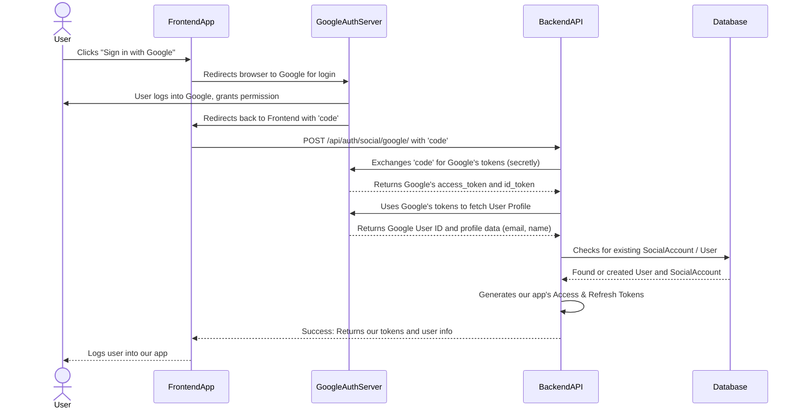

# Chapter 3: Social Login Provider Integration

Welcome back! In [Chapter 1: User and Account Data Models](01_user_and_account_data_models_.md), we learned how to store user information, including the `SocialAccount` model for linking to external services. Then, in [Chapter 2: User Authentication Flow (Backend)](02_user_authentication_flow__backend__.md), we explored how users register and log in with email and password, and how our backend handles these requests.

But what if users don't want to create *another* username and password for *another* website? Many people prefer the convenience of using their existing accounts from services like Google, GitHub, or Facebook to sign up and log in. This is where **"Social Login Provider Integration"** comes in!

Imagine our application is a grand international conference. We want to welcome attendees from all over the world. Instead of making everyone fill out a brand new, complex visa application, we decide to accept existing, trusted identification from their home countries (like a Google ID or a GitHub profile).

This chapter is about setting up the **diplomatic corps** within our backend. These "diplomats" are specialized to communicate with different "countries" (social providers) to verify a user's identity and let them into our application with ease.

---

### What Problem Does it Solve?

The main problem social login solves is **user convenience and reducing friction** during sign-up and login. Users don't need to remember another password, and they can often get started faster. For our application, it also means we can get verified basic user information directly from a trusted source.

**Central Use Case:** A new user wants to sign up for our application using their **Google account**. This chapter will guide you through how our backend integrates with Google (and other providers) to make this happen.

---

### Key Concepts of Social Login

Integrating social logins involves a few important ideas:

1.  **Social Login Providers:** These are the third-party services like Google, GitHub, Facebook, LinkedIn. Each has its own way of verifying users and sharing information.
2.  **OAuth 2.0:** This is the standard "language" or protocol our application uses to talk to social providers. It's not about *our* app logging into Google, but about Google giving *our app* permission to verify a user's identity.
3.  **Authorization Code Flow:** A common and secure way OAuth 2.0 works. The user first gives permission on the social provider's site, which then gives our app a temporary "code." Our backend exchanges this code for an "access token" (a secret key) to get user data.
4.  **Access Tokens and ID Tokens (from Social Provider):** These are temporary keys issued by the social provider (e.g., Google) that allow our backend to fetch the user's profile details.
5.  **Our `SocialAccount` Model:** Once we verify a user via a social provider, we need to link their social ID to our internal `User` record using the `SocialAccount` model we discussed in [Chapter 1: User and Account Data Models](01_user_and_account_data_models_.md).

---

### How it Works: The Social Login Dance

Let's trace the journey when a user wants to log in with Google.

#### The Big Picture Flow



This sequence shows that our backend acts as an intermediary, exchanging information securely with Google on behalf of the user, then creating or linking their account in our system.

---

### The Backend's Social Login Endpoint: `SocialAuthView`

Our backend has a special API endpoint dedicated to handling social login requests:

*   **Endpoint:** `/api/auth/social/<str:provider>/`
*   **Method:** `POST`
*   **Purpose:** Receives the temporary `code` from the frontend (or sometimes an `access_token` directly from the frontend, depending on the provider and flow) and handles the entire social login process.

The `<str:provider>` part in the URL is a placeholder that will be `google`, `github`, `facebook`, etc., depending on which service the user chose.

**Example Input (Frontend to Backend, for Google):**

After the user gives permission on Google's site, Google redirects them back to our frontend with a `code`. The frontend then sends this `code` to our backend:

```json
{
    "code": "4/0Ad....some_long_google_code....",
    "provider": "google"
    // "code_verifier": "..." (for PKCE, covered in Chapter 5)
}
```

**What the Backend Returns (Output):**

If successful, our backend responds with *our own* application's access and refresh tokens, just like a regular email/password login.

```json
{
    "access": "eyJhbGciOiJIUzI1Ni...", // Our app's access token
    "refresh": "eyJhbGciOiJIUzI1Ni...", // Our app's refresh token
    "user": {
        "id": 123,
        "username": "googlename",
        "email": "googleuser@example.com",
        "email_verified": true
    }
}
```

---

### Internal Implementation: The `SocialAuthView` Code Breakdown

Let's look at how the `SocialAuthView` in `backend/accounts/views.py` performs this "diplomatic" work.

#### 1. Receiving the Request and Initial Validation

```python
# File: backend/accounts/views.py

# ... (imports) ...
from .providers import PROVIDERS # A dictionary of our social provider handlers

class SocialAuthView(APIView):
    permission_classes = [AllowAny]

    @transaction.atomic # Ensures all database changes happen together or not at all
    def post(self, request, provider):
        if provider not in PROVIDERS:
            return Response({"detail": "Unsupported provider"}, status=400)

        # Use a serializer to validate the incoming data (code, access_token, etc.)
        serializer = SocialAuthSerializer(data={**request.data, 'provider': provider})
        serializer.is_valid(raise_exception=True)
        data = serializer.validated_data
        
        # Extract relevant info from the validated data
        code = data.get('code')
        # ... other tokens like access_token, id_token, code_verifier
        # ... (further logic to follow) ...
```

**Explanation:**
*   `if provider not in PROVIDERS`: This checks if the requested social provider (like "google") is one that our application supports.
*   `SocialAuthSerializer`: This helper makes sure the data received (like `code`) is in the correct format and is valid.
*   `@transaction.atomic`: This is a Django feature that treats all database operations within this function as a single unit. If anything goes wrong, all changes are rolled back, ensuring our data stays consistent.

#### 2. Exchanging the Authorization Code for Provider Tokens

If the frontend sends an `authorization code`, our backend needs to exchange it with the social provider for their `access_token` and `id_token`. Each provider has a different endpoint and slightly different requirements for this step.

```python
# File: backend/accounts/views.py (inside SocialAuthView.post)

        Provider = PROVIDERS[provider] # Get the specific provider handler (e.g., GoogleProvider)

        # If a 'code' was provided (typical for the secure OAuth flow)
        if code and not access_token: # 'access_token' might be directly provided for some flows
            try:
                # Specific logic for Google to exchange the code
                if provider == 'google':
                    payload = {
                        'code': code, 
                        'client_id': settings.GOOGLE_CLIENT_ID, 
                        'client_secret': settings.GOOGLE_CLIENT_SECRET, 
                        'redirect_uri': settings.OAUTH_REDIRECT_URI, 
                        'grant_type': 'authorization_code',
                        # 'code_verifier' for PKCE flow (Chapter 5)
                    }
                    r = requests.post('https://oauth2.googleapis.com/token', data=payload)
                    r.raise_for_status(); tok = r.json()
                    access_token = tok.get('access_token'); id_token = tok.get('id_token')

                # Similar 'elif' blocks would exist for GitHub, Facebook, LinkedIn...
                # For brevity, let's just show Google.
                # (See backend/accounts/providers.py for more detailed exchange logic)

            except requests.RequestException as e:
                return Response({'detail': 'Code exchange failed', 'error': str(e)}, status=400)
        # ... (further logic to follow) ...
```

**Explanation:**
*   `Provider = PROVIDERS[provider]`: This line is key! We're fetching the correct "diplomat" (e.g., `GoogleProvider` class) from our `PROVIDERS` dictionary based on the `provider` name in the URL.
*   `requests.post(...)`: Our backend makes a direct `POST` request to Google's token endpoint. We send Google our `code`, our `client_id`, `client_secret` (configured in `backend/social_api/settings.py` from `config.yaml`), and `redirect_uri`.
*   `r.raise_for_status()`: This checks if the request to Google was successful. If not, it raises an error.
*   `tok = r.json()`: We parse Google's response to get their `access_token` and `id_token`. These are temporary keys *from Google* that we'll use next.

#### 3. Fetching User Profile Data from the Provider

Now that we have the social provider's `access_token` (and sometimes `id_token`), we can ask them for the user's basic profile information.

```python
# File: backend/accounts/views.py (inside SocialAuthView.post, after code exchange)

        # If we have id_token or access_token from the provider, fetch user's profile
        try:
            if provider == 'google' and id_token:
                # Google can fetch user info directly from id_token
                uid, profile = Provider.fetch_user(id_token=id_token)
            else:
                # Other providers, or Google without id_token, use access_token
                uid, profile = Provider.fetch_user(access_token=access_token)

        except Exception as e:
            return Response({'detail': 'Failed to fetch user from provider', 'error': str(e)}, status=400)

        email = profile.get('email')
        name = profile.get('name') or ''
        # ... (further logic to follow) ...
```

**Explanation:**
*   `Provider.fetch_user(...)`: This calls a static method on our specific provider class (e.g., `GoogleProvider.fetch_user`). This method contains the specific logic to communicate with Google's user info endpoint.
*   `uid, profile = ...`: The `fetch_user` method returns the unique ID of the user from the social provider (`uid`) and a dictionary of their profile details (`profile`), such as email and name.

Let's peek into `backend/accounts/providers.py` to see what `GoogleProvider.fetch_user` actually does:

```python
# File: backend/accounts/providers.py (simplified)

import requests
from django.conf import settings
# ... other imports ...

class GoogleProvider:
    name = 'google'

    @staticmethod
    def fetch_user(access_token=None, id_token=None):
        if id_token:
            # For Google, id_token is a JWT we can verify ourselves
            # ... (verification logic for id_token) ...
            info = { 'sub': 'google_uid_from_jwt', 'email': 'user@google.com', 'name': 'John Doe' } # Simplified
            return info.get('sub'), { 'email': info.get('email'), 'name': info.get('name') }

        if access_token:
            # If only access_token, call Google's userinfo API
            r = requests.get(
                    'https://www.googleapis.com/oauth2/v3/userinfo', 
                    headers = {
                        'Authorization': f'Bearer { access_token }', # Send Google's access token
                    }
                )
            r.raise_for_status()
            data = r.json()
            return data.get('sub'), { 'email': data.get('email'), 'name': data.get('name') }
            
        raise ProviderError('Provide id_token or access_token')

# Similar classes exist for GitHub, Facebook, LinkedIn in PROVIDERS dictionary.
```

**Explanation of `providers.py`:**
*   Each `Provider` class (like `GoogleProvider`) is a specialized "diplomat" for a specific social platform.
*   `fetch_user`: This method handles the communication to get the user's profile. It makes an `HTTP GET` request to Google's user info API, including Google's `access_token` in the `Authorization` header.
*   `data.get('sub')`: For Google, `'sub'` is the unique identifier for that user.
*   The method returns this unique ID and a dictionary of profile data.

#### 4. Linking or Creating User and Social Account in Our Database

Once we have the user's ID and profile from Google, we need to check our own database.

```python
# File: backend/accounts/views.py (inside SocialAuthView.post, after fetching profile)

        try:
            # 1. Try to find an existing SocialAccount for this provider and UID
            social = SocialAccount.objects.select_related('user').get(provider=provider, provider_uid=uid)
            user = social.user # If found, we have an existing user

        except SocialAccount.DoesNotExist:
            user = None
            # 2. If no SocialAccount, try to find a User by email
            if email:
                user = User.objects.filter(email=email).first()
            
            # 3. If still no user, create a brand new User
            if not user:
                base_username = (name or email or f"{provider}_{uid}").split('@')[0].replace(' ', '').lower() or f"user_{str(uid)[:6]}"
                username = base_username; i = 1
                while User.objects.filter(username=username).exists(): # Ensure unique username
                    i += 1; username = f"{base_username}{i}"

                user = User.objects.create(
                            username = username, 
                            email = email or f"{provider}_{uid}@example.com", 
                            email_verified = bool(email) # Email is verified if provided by social login
                        )
            # 4. Create a new SocialAccount linking the User to this social ID
            SocialAccount.objects.create( 
                user=user, 
                provider=provider, 
                provider_uid=uid, 
                extra_data=profile
            )
        # ... (further logic to follow) ...
```

**Explanation:**
*   `SocialAccount.objects.get(provider=provider, provider_uid=uid)`: This is the first check. We try to find if we already have a `SocialAccount` linked to this specific Google ID. If yes, the user has logged in with Google before, and we retrieve their associated `User` object.
*   `User.objects.filter(email=email).first()`: If no `SocialAccount` is found, but the social provider gave us an email, we check if a `User` with that email already exists. This helps link social accounts to existing email-password accounts.
*   `User.objects.create(...)`: If neither an `SocialAccount` nor a `User` with that email exists, we create a **brand new `User`** account in our database. We try to use their name/email for a username, ensuring it's unique.
*   `SocialAccount.objects.create(...)`: Finally, we create a new `SocialAccount` record, linking our newly found or created `User` to their Google ID. This is crucial for future logins!

This entire section ensures that:
*   If a user logs in with Google repeatedly, they are linked to the *same* internal `User` account.
*   If a user signs up with Google and later signs up with GitHub (using the same email), we *might* link them to the same `User` account.
*   If it's a completely new user and social login, we create everything.

#### 5. Issuing Our Application's Tokens

Regardless of whether the user was new or existing, at this point, we have identified them in our system. Now, we issue *our own* application's access and refresh tokens so they can securely interact with our backend. This is the same process as a regular email/password login, as seen in [Chapter 2: User Authentication Flow (Backend)](02_user_authentication_flow__backend__.md).

```python
# File: backend/accounts/views.py (inside SocialAuthView.post, after database operations)

        # Generate our application's Refresh and Access Tokens for the user
        refresh = RefreshToken.for_user(user)
        access_token = str(refresh.access_token)
        refresh_token = str(refresh)

        response =  Response({
            'access': access_token, 
            'refresh': refresh_token, 
            'user': {
                'id': user.id, 
                'username': user.username, 
                'email': user.email, 
                'email_verified': user.email_verified
            }
        })

        # Store the refresh token in an HttpOnly cookie for security
        response.set_cookie(
            key="refresh_token",
            value=refresh_token,
            httponly=True,
            secure=not settings.DEBUG,  # Only secure in production
            samesite="Lax",
            max_age=14 * 24 * 60 * 60,  # 2 weeks
        )
        return response
```

**Explanation:**
*   `RefreshToken.for_user(user)`: Generates our application's JWT tokens for the authenticated `user`.
*   `response.set_cookie(...)`: Sets the `refresh_token` as an `HttpOnly` cookie. This is a security measure explained in [Chapter 2: User Authentication Flow (Backend)](02_user_authentication_flow__backend__.md), preventing JavaScript from accessing the cookie directly and making it harder for attackers to steal.

---

### Configuration for Social Logins (`config.yaml` & `settings.py`)

For social logins to work, our application needs "credentials" from each social provider. These are typically a `CLIENT_ID` and `CLIENT_SECRET` that you get when you register your application with Google, GitHub, etc. Think of these as our app's "passport" and "secret handshake" for talking to those providers.

These sensitive values are stored in `backend/config.yaml` (which is loaded into `backend/social_api/settings.py`):

```yaml
# File: backend/sample.config.yaml (snippet)

# ... other settings ...

GOOGLE_CLIENT_ID: "your-google-client-id" # Get this from Google Developer Console
GOOGLE_CLIENT_SECRET: "your-google-client-secret" # Get this from Google Developer Console

GITHUB_CLIENT_ID: "your-github-client-id" # Get this from GitHub Developer Settings
GITHUB_CLIENT_SECRET: "your-github-client-secret" # Get this from GitHub Developer Settings

# ... similar settings for Facebook, LinkedIn ...

OAUTH_REDIRECT_URI: "http://localhost:5173/auth/callback" # Crucial! This is where social providers redirect users back to our frontend.
```

**Explanation:**
*   You'll need to go to each social provider's developer console (e.g., Google Cloud Console, GitHub Developer Settings) to register your application and get these `CLIENT_ID` and `CLIENT_SECRET` values.
*   `OAUTH_REDIRECT_URI`: This URL tells the social provider where to send the user (and the `code`) *after* they successfully log in and grant permission. This must be correctly configured both in our `config.yaml` and on the social provider's side.

---

### Conclusion

In this chapter, we've integrated the "diplomatic corps" into our backend, allowing users to authenticate seamlessly using their existing social accounts. We learned how:

*   The `SocialAuthView` acts as a central hub for all social login requests.
*   Our backend communicates with social providers (like Google) to exchange authorization `code`s for provider `access_token`s.
*   We use these provider tokens to fetch essential user profile information (ID, email, name).
*   Our `SocialAccount` model (from [Chapter 1: User and Account Data Models](01_user_and_account_data_models_.md)) helps us link social identities to our internal `User` accounts, either by finding an existing user or creating a new one.
*   Finally, we issue our application's standard Access and Refresh tokens to the user, just like with a traditional login.

This powerful abstraction dramatically improves user experience by offering flexible and convenient login options. In the next chapter, we'll shift our focus to securing email-based accounts by diving into the **Email Verification System**.

[Next Chapter: Email Verification System](04_email_verification_system_.md)

---

<sub><sup>Written by [Devesh](https://github.com/devesh111).</sup></sub> <sub><sup>**References**: [[1]](https://github.com/devesh111/Complete-User-Authentication/blob/be7caf6a301c77116064d4b37322e7e9673afa30/backend/accounts/providers.py), [[2]](https://github.com/devesh111/Complete-User-Authentication/blob/be7caf6a301c77116064d4b37322e7e9673afa30/backend/accounts/views.py), [[3]](https://github.com/devesh111/Complete-User-Authentication/blob/be7caf6a301c77116064d4b37322e7e9673afa30/backend/sample.config.yaml), [[4]](https://github.com/devesh111/Complete-User-Authentication/blob/be7caf6a301c77116064d4b37322e7e9673afa30/backend/social_api/settings.py)</sup></sub>