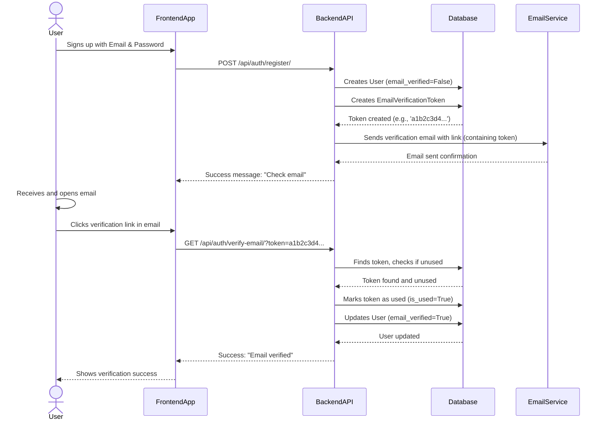

# Chapter 4: Email Verification System

Welcome back! In our journey through "Complete User Authentication," we've already covered a lot. In [Chapter 1: User and Account Data Models](01_user_and_account_data_models_.md), we designed our blueprints, including the `EmailVerificationToken` model. Then, in [Chapter 2: User Authentication Flow (Backend)](02_user_authentication_flow__backend__.md), we saw how users register and log in, and how registration kicks off the email verification process. Most recently, in [Chapter 3: Social Login Provider Integration](03_social_login_provider_integration_.md), we explored how users can sign up using services like Google.

Now, let's focus on a crucial step for traditional email and password registrations: the **Email Verification System**.

Imagine you've just signed up for a new online service. Right after you click "Register," you might see a message saying, "Please check your email to verify your account." This system is what makes that message (and the entire process) work! It's like a mail-in identity confirmation, ensuring that the email address you provided actually reaches you and belongs to you.

---

### What Problem Does it Solve?

The main problem the Email Verification System solves is **confirming the validity and ownership of a user's email address**. Without it, people could register with fake email addresses, spam your system, or even create accounts using someone else's email.

**Central Use Case:** A user signs up for our application with their email and password. Our system needs to make sure their email is real before they can fully use their account.

This chapter will guide you through how our backend ensures only legitimate email addresses are associated with accounts.

---

### Key Concepts of Email Verification

This system involves a few simple but important ideas:

1.  **Unique Token**: A secret, one-time-use code generated when a user registers. This code is unique to each user and each verification attempt.
2.  **Verification Email**: An email sent to the user's registered address, containing the unique token, usually embedded in a special link.
3.  **Verification Link**: The clickable URL in the email. When clicked, it sends the unique token back to our backend.
4.  **Backend Endpoint**: A specific "door" in our backend that receives the verification link (and token) and processes it.
5.  **User Status Update**: Once the token is verified, the user's account status (specifically, their `email_verified` field) is updated to `True`.

---

### How it Works: The Email Verification Journey

Let's trace the steps a user takes from registration to a verified email.

#### The Big Picture Flow



This sequence shows that after registration, the user interacts with their email, and then our frontend (or direct browser access) triggers a call to our backend to confirm the token.

---

### Internal Implementation: The Code Breakdown

Let's look at the specific code pieces that make this system tick, referencing our models and views from previous chapters.

#### 1. Creating the Email Verification Token (During Registration)

As we saw in [Chapter 2: User Authentication Flow (Backend)](02_user_authentication_flow__backend__.md), when a user first registers with an email, our backend creates a special token for them.

The `EmailVerificationToken` model from [Chapter 1: User and Account Data Models](01_user_and_account_data_models_.md) is used here:

```python
# File: backend/accounts/models.py (from Chapter 1)

import uuid # Used to generate unique tokens
# ... other imports ...

class EmailVerificationToken(models.Model):
    user = models.ForeignKey(User, on_delete=models.CASCADE, related_name='email_tokens')
    token = models.UUIDField(default=uuid.uuid4, unique=True, editable=False)
    created_at = models.DateTimeField(default=timezone.now)
    is_used = models.BooleanField(default=False)
```

And this is how it's created in the `RegisterView`:

```python
# File: backend/accounts/views.py (snippet from RegisterView)

from .models import EmailVerificationToken
from .emails import send_verification_email # We'll see this next

class RegisterView(APIView):
    # ...
    def post(self, request):
        ser = RegisterSerializer(data=request.data)
        ser.is_valid(raise_exception=True)
        user = ser.save() # User is created, email_verified=False by default

        # Create a unique token for this new user
        token_obj = EmailVerificationToken.objects.create(user=user)
        
        # Send the email with this token
        send_verification_email(user.email, str(token_obj.token))
        
        return Response(
            {"message": "Registered. Please verify email."}, 
            status=201
        )
```

**Explanation:**
*   `user = ser.save()`: When a new user account is successfully saved, their `email_verified` status is `False` by default.
*   `EmailVerificationToken.objects.create(user=user)`: A new `EmailVerificationToken` record is created in the database. It automatically gets a unique `token` (a long string of numbers and letters generated by `uuid.uuid4`) and is linked to the `user`. `is_used` is set to `False`.

#### 2. Sending the Verification Email

Once the token is created, we need to send it to the user. This is handled by a helper function.

```python
# File: backend/accounts/emails.py

from django.core.mail import send_mail
from django.conf import settings # To get settings like HOST and sender email

def send_verification_email(email: str, token: str):
    # Construct the full verification URL that the user will click
    verify_url = f"{settings.HOST}/api/auth/verify-email/?token={token}"
    
    subject = "Verify your email"
    body = f"Hello! Please click the link below to verify your email:\n\n{verify_url}\n\nIf you did not register for this service, please ignore this email."
    
    # Send the email using Django's built-in mail function
    send_mail(
        subject, 
        body, 
        settings.DEFAULT_FROM_EMAIL, # Our sending email address
        [email], # The user's email address
        fail_silently=True # Don't crash if email sending fails
    )
```

**Explanation:**
*   `verify_url = f"{settings.HOST}/api/auth/verify-email/?token={token}"`: This is the crucial part. We build a URL that points to our backend's verification endpoint (`/api/auth/verify-email/`) and includes the unique `token` as a query parameter.
*   `send_mail(...)`: Django provides a simple way to send emails. We give it the subject, the email body (which includes our `verify_url`), the sender, and the recipient.

#### 3. Processing the Verification Link

When the user clicks the `verify_url` in their email, their browser sends a `GET` request to our backend. Our `VerifyEmailView` endpoint handles this.

*   **Endpoint:** `/api/auth/verify-email/`
*   **Method:** `GET` (because the browser is just *requesting* to perform an action based on the URL)

**Example Input (from Browser to Backend):**

```
GET /api/auth/verify-email/?token=a1b2c3d4-e5f6-7890-1234-567890abcdef HTTP/1.1
Host: your-app-domain.com
```

**What the Backend Does Internally:**

```python
# File: backend/accounts/views.py (VerifyEmailView)

from rest_framework import status
from rest_framework.response import Response
from rest_framework.views import APIView
from rest_framework.permissions import AllowAny
from .models import EmailVerificationToken, User # Need both models

class VerifyEmailView(APIView):
    permission_classes = [AllowAny] # Anyone can try to verify an email
    
    def get(self, request):
        # 1. Get the token from the URL's query parameters
        token = request.query_params.get('token')
        
        if not token: # Basic check if token exists
            return Response({"detail": "Token is missing"}, status=400)

        try:
            # 2. Find the token in the database and check if it hasn't been used yet
            t = EmailVerificationToken.objects.get(token=token, is_used=False)
        except EmailVerificationToken.DoesNotExist:
            # If token not found or already used, it's invalid
            return Response({"detail": "Invalid or expired token"}, status=400)
        
        # 3. Mark the token as used to prevent it from being used again
        t.is_used = True
        t.save(update_fields=['is_used']) # Save only this field
        
        # 4. Update the user's email_verified status to True
        user = t.user # Get the user linked to this token
        user.email_verified = True
        user.save(update_fields=['email_verified']) # Save only this field
        
        # 5. Send a success response
        return Response({"message": "Email successfully verified!"})
```

**Explanation:**
*   `token = request.query_params.get('token')`: This extracts the `token` value from the URL (e.g., `a1b2c3d4...`).
*   `EmailVerificationToken.objects.get(token=token, is_used=False)`: Our backend queries the `EmailVerificationToken` table to find a matching token that **has not been used yet**. This is important for security; a token should only work once.
*   `t.is_used = True; t.save()`: Once found and validated, the token is marked as `used` in the database.
*   `user = t.user`: We get the `User` object that this token is linked to.
*   `user.email_verified = True; user.save()`: The `email_verified` field on the user's account is updated to `True`.
*   A success message is returned.

#### What Happens to `email_verified`?

The `email_verified` field (which we defined in our `User` model in [Chapter 1: User and Account Data Models](01_user_and_account_data_models_.md)) is a simple `True`/`False` flag. It starts as `False` upon registration and becomes `True` after successful email verification.

This flag can be used throughout your application to:
*   **Restrict features**: Maybe some advanced features are only available to verified users.
*   **Show messages**: Remind users to verify their email if `email_verified` is `False`.
*   **Prevent login**: You could even configure your `LoginView` to only allow users with `email_verified=True` to log in (though our current `LoginView` in [Chapter 2](02_user_authentication_flow__backend__.md) does not enforce this by default, it's a common security addition).

---

### Conclusion

In this chapter, we've successfully built our "Email Verification System." We've seen how:

*   A unique `EmailVerificationToken` is generated upon user registration.
*   A verification email containing a special link is sent to the user's email address.
*   Our `VerifyEmailView` endpoint processes this link, validating the token.
*   Upon successful validation, the token is marked as used, and the user's `email_verified` status is updated to `True` in the database.

This system is a simple yet powerful way to ensure the authenticity of user email addresses, adding a crucial layer of security and trust to our application.

Next, we'll dive into another important security concept, especially relevant for social logins and mobile applications: **PKCE (Proof Key for Code Exchange)**.

[Next Chapter: PKCE (Proof Key for Code Exchange) Security](05_pkce__proof_key_for_code_exchange__security_.md)

---

<sub><sup>Written by [Devesh](https://github.com/devesh111).</sup></sub> <sub><sup>**References**: [[1]](https://github.com/devesh111/Complete-User-Authentication/blob/be7caf6a301c77116064d4b37322e7e9673afa30/backend/accounts/emails.py), [[2]](https://github.com/devesh111/Complete-User-Authentication/blob/be7caf6a301c77116064d4b37322e7e9673afa30/backend/accounts/models.py), [[3]](https://github.com/devesh111/Complete-User-Authentication/blob/be7caf6a301c77116064d4b37322e7e9673afa30/backend/accounts/views.py)</sup></sub>