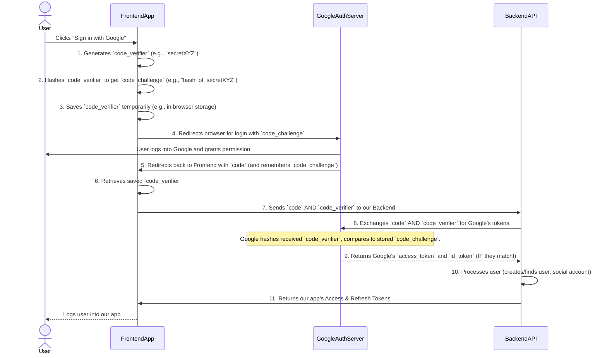

# Chapter 5: PKCE (Proof Key for Code Exchange) Security

Welcome back! In our last chapter, [Chapter 4: Email Verification System](04_email_verification_system_.md), we learned how to confirm a user's email address. Before that, in [Chapter 3: Social Login Provider Integration](03_social_login_provider_integration_.md), we explored how users can sign up and log in using services like Google or GitHub.

Now, we're going to dive into an important security concept called **PKCE (Proof Key for Code Exchange)**. This might sound complicated, but it's like adding a secret handshake to our social login process to make it extra secure, especially for applications that run directly in a user's browser (like our frontend).

Imagine you're sending a sensitive letter to a trusted friend. You want to be absolutely sure that only *they* can open it, even if someone intercepts it along the way. PKCE is like putting a special, one-time-use lock on that letter, and only your friend has the matching key.

---

### What Problem Does it Solve?

The main problem PKCE solves is protecting against **authorization code interception attacks**. Let's break that down:

When you use "Sign in with Google," our frontend (your browser) is redirected to Google, you log in, and Google then sends you back to our frontend with a temporary "authorization `code`." Our backend then takes this `code` and exchanges it with Google for proper access tokens.

The vulnerability is: What if a malicious app or script on your computer manages to **steal that `code`** while it's being sent back to our frontend? If an attacker gets this `code`, they could potentially use it to impersonate you and log into your account on our application!

This is especially a problem for "public clients" like our single-page application (SPA). Unlike a server (a "confidential client") that can securely store a `client_secret` to prove its identity, a browser-based application can't hide secrets. PKCE provides a way for these public clients to prove they are the legitimate application, even without a secret.

**Central Use Case:** A user signs up or logs in with their Google, GitHub, or LinkedIn account from our frontend application. PKCE ensures that the temporary `code` received from these social providers can only be exchanged for tokens by *our specific application*, preventing attackers from hijacking the login process.

---

### Key Concepts of PKCE

PKCE adds a clever two-step verification to the standard OAuth 2.0 Authorization Code Flow:

1.  **`code_verifier` (The Secret Key)**: This is a long, random string of characters (like `ABCxyz123...`) that our frontend application generates *just for this one login attempt*. It's a secret that only our frontend knows.
2.  **`code_challenge` (The Hashed Key)**: Our frontend takes the `code_verifier` and uses a special mathematical function (called SHA256) to "hash" it. This creates a different, but unique, string called the `code_challenge` (e.g., `JHD72Hsd...`). Think of it as a fingerprint of the `code_verifier`. This `code_challenge` is **publicly sent** to the social provider (Google, GitHub) in the initial login request.
3.  **Authorization Server (e.g., Google, GitHub, LinkedIn)**: This is the social provider. It receives the `code_challenge` and remembers it.
4.  **Proof of Possession**: Later, when our backend asks the Authorization Server to exchange the `code` for actual tokens, it *must* also present the original `code_verifier`. The Authorization Server then takes this `code_verifier`, hashes it itself, and checks if it matches the `code_challenge` it initially received. If they match, it knows our backend is acting on behalf of the correct application. If they don't match, it means someone else is trying to use a stolen `code`, and the request is denied.

It's like this: When you send the sensitive letter, you tell the post office (Authorization Server) a special "checksum" (the `code_challenge`). When your friend receives the letter, they must tell the post office the *original message* (the `code_verifier`) that generates that checksum. If it matches, the post office delivers the content.

---

### How it Works: The PKCE Security Dance

Let's revisit the social login flow from [Chapter 3: Social Login Provider Integration](03_social_login_provider_integration_.md) and see how PKCE adds its security steps.

#### The PKCE Enhanced Social Login Flow



Notice the extra steps (1, 2, 3, 4, 6, 7, 8, 9) involving the `code_verifier` and `code_challenge`. This ensures that even if an attacker snatches the `code` at step 5, they won't have the secret `code_verifier` needed at step 8 to complete the login.

---

### Internal Implementation: The Code Breakdown

Let's see how PKCE is implemented in our frontend and backend.

#### 1. Frontend: Generating and Storing PKCE Values

Our `frontend/src/utils/pkce.js` file contains helper functions to create the `code_verifier` and `code_challenge`.

```javascript
// File: frontend/src/utils/pkce.js

export function randomString(length = 64) {
    // Generates a random string of specified length (our code_verifier)
    const charset = "0123456789ABCDEFGHIJKLMNOPQRSTUVWXYZabcdefghijklmnopqrstuvwxyz-._~";
    let result = "";
    const values = new Uint8Array(length);
    crypto.getRandomValues(values); // Get cryptographically strong random values
    for (let i = 0; i < length; i++)
        result += charset[values[i] % charset.length];
    return result;
}

export async function generateCodeChallenge(code_verifier) {
    // Hashes the code_verifier using SHA-256 (our code_challenge)
    const encoder = new TextEncoder();
    const data = encoder.encode(code_verifier);
    const digest = await crypto.subtle.digest("SHA-256", data);
    const base64 = btoa(String.fromCharCode(...new Uint8Array(digest)))
        .replace(/\+/g, "-")
        .replace(/\//g, "_")
        .replace(/=+$/, ""); // URL-safe Base64 encoding
    return base64;
}
```

Now, let's see how `frontend/src/components/SocialLoginButtons.jsx` uses these to prepare the social login URL:

```javascript
// File: frontend/src/components/SocialLoginButtons.jsx (snippet)

import { randomString, generateCodeChallenge } from "../utils/pkce"; // Import our PKCE helpers

// ... other code ...

export default function SocialLoginButtons({ className = "" }) {
    // ... other code ...

    const openProvider = async (provider) => {
        const state = saveState({ provider }); // Stores info about this login attempt
        
        // --- PKCE Step 1 & 2: Generate verifier and challenge ---
        const code_verifier = randomString(64); // Our secret key
        const code_challenge = await generateCodeChallenge(code_verifier); // Its hashed fingerprint
        
        // --- PKCE Step 3: Save verifier for later ---
        // We link it to a 'nonce' (a random number in the 'state') to retrieve it later.
        const decoded = JSON.parse(atob(state));
        localStorage.setItem("pkce_" + decoded.nonce, code_verifier);

        let url = "";
        if (provider === "google") {
            const clientId = import.meta.env.VITE_GOOGLE_CLIENT_ID;
            const scope = encodeURIComponent("openid email profile");
            // --- PKCE Step 4: Include code_challenge in redirect URL ---
            url = `https://accounts.google.com/o/oauth2/v2/auth?response_type=code&client_id=${clientId}&redirect_uri=${redirectUri}&scope=${scope}&state=${state}&code_challenge=${code_challenge}&code_challenge_method=S256&access_type=offline&prompt=select_account`;
        } else if (provider === "github") {
            const clientId = import.meta.env.VITE_GITHUB_CLIENT_ID;
            const scope = encodeURIComponent("read:user user:email");
            // --- PKCE Step 4: Include code_challenge for GitHub too ---
            url = `https://github.com/login/oauth/authorize?client_id=${clientId}&redirect_uri=${redirectUri}&scope=${scope}&state=${state}&code_challenge=${code_challenge}&code_challenge_method=S256`;
        } else if (provider === "facebook") {
            // Facebook often uses a simpler flow, so PKCE might not be needed by default here
            const clientId = import.meta.env.VITE_FACEBOOK_CLIENT_ID;
            const scope = encodeURIComponent("email public_profile");
            url = `https://www.facebook.com/v17.0/dialog/oauth?client_id=${clientId}&redirect_uri=${redirectUri}&state=${state}&scope=${scope}&response_type=code`;
        } else if (provider === "linkedin") {
            const clientId = import.meta.env.VITE_LINKEDIN_CLIENT_ID;
            const scope = encodeURIComponent("r_liteprofile r_emailaddress");
            // --- PKCE Step 4: Include code_challenge for LinkedIn ---
            url = `https://www.linkedin.com/oauth/v2/authorization?response_type=code&client_id=${clientId}&redirect_uri=${redirectUri}&scope=${scope}&state=${state}&code_challenge=${code_challenge}&code_challenge_method=S256`;
        } else {
            alert("Unsupported provider");
            return;
        }

        window.location.href = url; // Redirect user to the social provider
    };

    // ... other code ...
}
```

**Explanation:**
*   `randomString(64)` generates our `code_verifier`.
*   `generateCodeChallenge(code_verifier)` calculates the `code_challenge`.
*   `localStorage.setItem("pkce_" + decoded.nonce, code_verifier);` temporarily saves the `code_verifier` in the browser's local storage. This is crucial because the frontend needs it *after* Google redirects back.
*   The `code_challenge` and `code_challenge_method=S256` (indicating the SHA-256 hashing method) are added to the URL parameters when redirecting to Google, GitHub, or LinkedIn.

#### 2. Frontend: Sending `code_verifier` to our Backend

After the social provider (e.g., Google) redirects back to our frontend with the `code`, our frontend (`OAuthCallback.jsx`) retrieves the saved `code_verifier` and sends it to our backend.

```javascript
// File: frontend/src/pages/OAuthCallback.jsx (snippet)

// ... imports ...

export default function OAuthCallback() {
    // ... state and hooks ...

    useEffect(() => {
        async function handle() {
            try {
                const qs = parseQuery(location.search);
                const { code, state, error, error_description } = qs;
                // ... error handling and state validation ...
                
                // --- PKCE Step 6: Retrieve saved code_verifier ---
                const code_verifier =
                    localStorage.getItem("pkce_" + nonce) || null; // Get it from local storage
                
                const apiUrlBase = import.meta.env.VITE_API_URL || "http://localhost:8000/api";
                const body = { code };
                
                // --- PKCE Step 7: Add code_verifier to the request body if it exists ---
                if (code_verifier) body.code_verifier = code_verifier; 
                
                const res = await fetch(
                    `${apiUrlBase}/auth/social/${provider}/`,
                    {
                        method: "POST",
                        headers: { "Content-Type": "application/json" },
                        credentials: "include",
                        body: JSON.stringify(body), // Sends code and code_verifier to backend
                    },
                );
                
                // ... response handling and dispatching ...
                localStorage.removeItem("oauth_state_" + nonce);
                localStorage.removeItem("pkce_" + nonce); // Clean up the stored verifier
                // ... redirect ...
            } catch (e) { /* ... error handling ... */ }
        }
        handle();
    }, []);

    // ... JSX ...
}
```

**Explanation:**
*   `localStorage.getItem("pkce_" + nonce)` retrieves the `code_verifier` that was saved earlier.
*   The `code_verifier` is then included in the `POST` request body when our frontend communicates with our backend's social authentication endpoint (`/api/auth/social/<provider>/`).

#### 3. Backend: Using `code_verifier` for the Token Exchange

Finally, our backend (`SocialAuthView` in `backend/accounts/views.py`) receives the `code` and `code_verifier` from our frontend. It then includes the `code_verifier` when making its own request to the social provider's token endpoint.

```python
# File: backend/accounts/views.py (snippet from SocialAuthView.post)

# ... imports ...

class SocialAuthView(APIView):
    # ... @transaction.atomic ...
    def post(self, request, provider):
        # ... validation and data extraction ...
        data = serializer.validated_data
        code = data.get('code')
        # --- PKCE Step 7 (Backend side): Extract code_verifier from frontend's request ---
        code_verifier = data.get('code_verifier') 
        # ... access_token, id_token ...

        # If code provided, exchange it
        if code and not access_token:
            try:
                if provider == 'google':
                    token_url = 'https://oauth2.googleapis.com/token'
                    payload = {
                        'code': code, 
                        'client_id': settings.GOOGLE_CLIENT_ID, 
                        'client_secret': settings.GOOGLE_CLIENT_SECRET, # Our backend uses its client_secret
                        'redirect_uri': settings.OAUTH_REDIRECT_URI, 
                        'grant_type': 'authorization_code',
                    }
                    # --- PKCE Step 8: Add code_verifier to the payload for Google ---
                    if code_verifier: payload['code_verifier'] = code_verifier 
                    r = requests.post(token_url, data = payload)
                    r.raise_for_status(); tok = r.json()
                    # ... get tokens ...

                # --- PKCE Step 8 (for LinkedIn): ---
                elif provider == 'linkedin':
                    token_url = 'https://www.linkedin.com/oauth/v2/accessToken'
                    payload = {
                        'grant_type': 'authorization_code',
                        'code': code,
                        'client_id': settings.LINKEDIN_CLIENT_ID,
                        'client_secret': settings.LINKEDIN_CLIENT_SECRET,
                        'redirect_uri': settings.OAUTH_REDIRECT_URI,
                    }
                    if code_verifier: payload['code_verifier'] = code_verifier
                    r = requests.post(token_url, data=payload)
                    r.raise_for_status(); access_token = r.json().get('access_token')

                # Similar logic for GitHub (already in place in the full code)
                # ... other providers ...

            except requests.RequestException as e:
                # ... error handling ...
        # ... rest of the social login logic ...
```

**Explanation:**
*   `code_verifier = data.get('code_verifier')`: Our backend extracts the `code_verifier` from the data sent by the frontend.
*   `if code_verifier: payload['code_verifier'] = code_verifier`: The `code_verifier` is added to the `payload` that our backend sends to Google's (or LinkedIn's/GitHub's) token exchange endpoint.
*   Google (the Authorization Server) will then perform its internal check: it will hash this received `code_verifier` and compare it to the `code_challenge` it initially stored. If they match, it proceeds with issuing the tokens. If not, it rejects the request, protecting the user.

---

### Which Social Providers Use PKCE?

Not all social login providers require or implement PKCE in the same way. It's becoming more common for public clients.

| Provider | PKCE Support (in our project) | Notes                                                              |
| :------- | :---------------------------- | :----------------------------------------------------------------- |
| **Google** | Yes                           | Highly recommended and used for SPAs.                              |
| **GitHub** | Yes                           | Supported and used for enhanced security.                          |
| **LinkedIn** | Yes                           | Supported and used.                                                |
| **Facebook** | No                            | Often uses a simpler flow for web apps that doesn't strictly require PKCE by default. |

---

### Conclusion

In this chapter, we've introduced **PKCE (Proof Key for Code Exchange) Security**, a vital enhancement for securing OAuth 2.0 flows, especially for public clients like our browser-based frontend. We learned:

*   PKCE protects against `authorization code interception attacks` by making sure only our legitimate application can exchange the temporary `code` for tokens.
*   It works by having our frontend generate a secret `code_verifier`, hashing it into a `code_challenge`, and sending the `code_challenge` to the social provider.
*   Later, our backend must present the original `code_verifier` to the social provider to prove its legitimacy.
*   We saw how this "secret handshake" is implemented in both our frontend and backend for providers like Google, GitHub, and LinkedIn.

PKCE adds a significant layer of trust and security, making sure that when a user logs in via a social account, their identity is protected throughout the process.

Next, we'll shift our focus to the **API Communication Layer (Frontend)**, understanding how our frontend effectively talks to our secure backend.

[Next Chapter: API Communication Layer (Frontend)](06_api_communication_layer__frontend__.md)

---

<sub><sup>Written by [Devesh](https://github.com/devesh111).</sup></sub> <sub><sup>**References**: [[1]](https://github.com/devesh111/Complete-User-Authentication/blob/be7caf6a301c77116064d4b37322e7e9673afa30/backend/accounts/views.py), [[2]](https://github.com/devesh111/Complete-User-Authentication/blob/be7caf6a301c77116064d4b37322e7e9673afa30/frontend/src/components/SocialLoginButtons.jsx), [[3]](https://github.com/devesh111/Complete-User-Authentication/blob/be7caf6a301c77116064d4b37322e7e9673afa30/frontend/src/pages/OAuthCallback.jsx), [[4]](https://github.com/devesh111/Complete-User-Authentication/blob/be7caf6a301c77116064d4b37322e7e9673afa30/frontend/src/utils/pkce.js)</sup></sub>