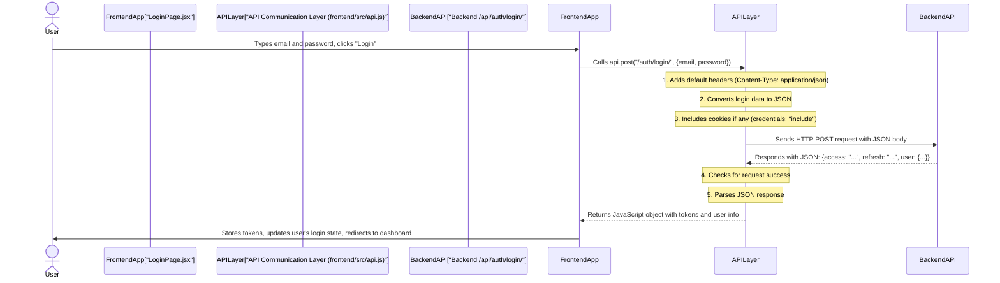

# Chapter 6: API Communication Layer (Frontend)

Welcome back, future frontend wizards! In our last chapter, [Chapter 5: PKCE (Proof Key for Code Exchange) Security](05_pkce__proof_key_for_code_exchange__security_.md), we added a secret handshake to our social login process, making it super secure. We saw how the frontend needed to prepare special codes before talking to social providers and then send those codes to our backend.

But how does our frontend application (what the user sees) actually *talk* to our backend API (where all the logic and data live)? It's like having a grand library, but no one knows how to ask the librarian for a book. You need a clear, consistent way to communicate!

This is where the **"API Communication Layer (Frontend)"** comes in. Imagine it as our frontend's dedicated **"messenger service"**. Instead of directly yelling commands at the backend in a chaotic way, all requests go through this organized messenger. This ensures every message is sent clearly, securely, and consistently.

---

### What Problem Does it Solve?

The main problem this layer solves is making **frontend-to-backend communication simple, reliable, and standardized**. Without it, every time our frontend needs to send data (like a login form) or ask for data (like a user's profile), we'd have to write a lot of repetitive code. This layer handles all the nitty-gritty details, so our other frontend parts (like login forms or dashboard pages) can just say, "Hey messenger, ask the backend to log this user in!"

**Central Use Case:** A user wants to log into our application using their email and password. Our frontend needs to send these credentials to the backend's login endpoint and then handle the response (success or failure). This chapter will show how our API Communication Layer makes this process straightforward.

---

### Key Concepts of the API Communication Layer

Our "messenger service" handles a few important things:

1.  **HTTP Requests**: The standard way web applications talk to each other. We primarily use `GET` (to ask for data) and `POST` (to send data and create/update things).
2.  **API Endpoints**: Specific URLs on our backend that handle different actions (e.g., `/api/auth/login/`, `/api/auth/register/`).
3.  **JSON Data**: The common language for sending information between web applications. Our frontend sends data as JSON, and our backend responds with JSON.
4.  **Credentials (`credentials: "include"`)**: This important setting tells the browser to automatically include any stored cookies (like our `refresh_token` cookie from [Chapter 2: User Authentication Flow (Backend)](02_user_authentication_flow__backend__.md)) with every request. This is how our frontend stays "logged in" across requests.
5.  **Error Handling**: If something goes wrong (e.g., wrong password, server error), our messenger knows how to catch it and pass on a clear error message.

---

### How it Works: Our `api.js` Helper

In our project, the `frontend/src/api.js` file is our lightweight API Communication Layer. It provides simple functions that abstract away the complexity of making `fetch` requests.

#### The `api.js` Messenger

```javascript
// File: frontend/src/api.js

// This is the base URL for our backend API
const API_URL = import.meta.env.VITE_API_URL || "http://localhost:8000/api";

// The core function that all requests go through
async function request(endpoint, options = {}) {
    // 1. Send the actual HTTP request to our backend
    const res = await fetch(API_URL + endpoint, {
        // Always include cookies with requests
        credentials: "include", 
        headers: {
            "Content-Type": "application/json", // We usually send and expect JSON
            ...(options.headers || {}), // Allow custom headers
        },
        ...options, // Other options like method (GET, POST), body
    });

    // 2. Check if the request was successful (HTTP status 200-299)
    if (!res.ok) {
        // If not successful, read the error message and throw an error
        const txt = await res.text();
        throw new Error(txt || "Request failed");
    }

    // 3. If successful, parse the response as JSON and return it
    return res.json();
}

// Simple helper functions for GET and POST requests
export default {
    get: (url, opts) => request(url, { method: "GET", ...opts }),
    post: (url, body, opts) =>
        request(url, { method: "POST", body: JSON.stringify(body), ...opts }),
};
```

**Explanation:**

*   `API_URL`: This tells our messenger where our backend lives.
*   `request(endpoint, options)`: This is the brain of our messenger.
    *   It uses `fetch()` to send the actual request.
    *   `credentials: "include"`: **This is very important!** It ensures that any cookies (like our `refresh_token`) that the browser has for our backend's domain are automatically sent with the request. This allows our backend to identify us for certain actions.
    *   `Content-Type: application/json`: Most of our communication with the backend uses JSON format, so this header is usually added automatically.
    *   `if (!res.ok)`: This checks if the backend responded with a successful status code (like 200 OK). If not, it assumes there was an error and throws it.
    *   `res.json()`: If successful, it takes the backend's response and converts it from JSON text into a JavaScript object.
*   `export default { get, post }`: These are the easy-to-use functions. When you call `api.post("/some-url/", myData)`, it automatically sets the `method` to `POST` and converts `myData` into a JSON string for the request body.

---

### Using the API Layer: Login Example

Let's see our API Communication Layer in action with the login process.

#### The Login Flow with our API Layer



#### Code Example: `LoginPage.jsx`

Here's how our `LoginPage.jsx` uses the `api.post` messenger function:

```javascript
// File: frontend/src/pages/LoginPage.jsx (snippet)

import api from "../api"; // Import our API messenger
// ... other imports ...

export default function LoginPage() {
    // ... state setup ...

    const handleSubmit = async (e) => {
        e.preventDefault();
        setLoading(true);
        setMsg("");
        try {
            // This is it! We tell our API messenger to POST to /auth/login/
            // and pass it the form data. It handles all the HTTP details.
            const res = await api.post("/auth/login/", form);
            // If successful, 'res' now holds the JavaScript object
            // with access token, refresh token, and user data.
            dispatch(setAccess(res.access)); // Store access token
            dispatch(setUser(res.user));     // Store user info
        } catch (err) {
            setMsg("Invalid credentials"); // Handle any errors caught by api.js
        } finally {
            setLoading(false);
        }
    };

    // ... JSX ...
}
```

**Explanation:**

*   `import api from "../api";`: This line brings our messenger service into `LoginPage.jsx`.
*   `await api.post("/auth/login/", form)`: This is the magic! The `LoginPage` doesn't worry about `fetch`, headers, JSON conversion, or error checking. It just says: "Hey `api` messenger, please `POST` this `form` data to the `/auth/login/` endpoint."
*   If the login is successful, `res` will be a JavaScript object containing the `access` token, `refresh` token, and `user` object from the backend (as seen in [Chapter 2: User Authentication Flow (Backend)](02_user_authentication_flow__backend__.md)).
*   If the login fails (e.g., incorrect password), the `api.post` call will `throw` an error, which `LoginPage` then `catch`es and displays to the user.

#### Another Example: Registering a User

Registering a user is just as simple:

```javascript
// File: frontend/src/pages/RegisterPage.jsx (snippet)

import api from "../api"; // Import our API messenger
// ... other imports ...

export default function RegisterPage() {
    // ... state setup ...

    const handleSubmit = async (e) => {
        e.preventDefault();
        setLoading(true);
        setMsg("");
        try {
            // Same pattern: use the api messenger for registration
            const res = await api.post("/auth/register/", form);
            setMsg(res.message || "Registered. Check email to verify.");
        } catch (err) {
            setMsg("Registration failed");
        } finally {
            setLoading(false);
        }
    };

    // ... JSX ...
}
```

Here, `api.post("/auth/register/", form)` sends the username, email, and password to the backend, expecting a success message back (as described in [Chapter 2: User Authentication Flow (Backend)](02_user_authentication_flow__backend__.md) and [Chapter 4: Email Verification System](04_email_verification_system_.md)).

---

### Special Cases: Direct `fetch` for Non-JSON Requests

While `api.js` is great for requests with JSON bodies, some endpoints in our backend don't require a request body at all, or they don't expect JSON. For these specific cases, our project sometimes uses `fetch` directly for simplicity, focusing just on including credentials (cookies).

#### Example: Refreshing an Access Token

Remember the refresh token from [Chapter 2: User Authentication Flow (Backend)](02_user_authentication_flow__backend__.md)? It's sent as an HttpOnly cookie, so the request to refresh it doesn't need a JSON body.

```javascript
// File: frontend/src/store/authSlice.js (snippet)

export const refreshToken = createAsyncThunk("auth/refresh", async () => {
    const apiUrl = import.meta.env.VITE_API_URL || "http://localhost:8000/api";
    // Direct fetch, primarily relying on 'credentials: "include"' for the cookie
    const res = await fetch(apiUrl + "/auth/token/refresh/", {
        method: "POST",
        credentials: "include", // Essential for sending the refresh_token cookie
    });
    // ... error handling and parsing ...
    const data = await res.json();
    return data.access;
});
```

**Explanation:**
*   This `fetch` call is directly made because it's a `POST` request without a JSON body. The backend relies solely on the `refresh_token` cookie for authentication.
*   `credentials: "include"` is still crucial here! It ensures the browser sends the `refresh_token` cookie with the request.

#### Example: Logging Out

Logging out is similar; it invalidates the refresh token (by deleting its cookie), which also doesn't require a request body.

```javascript
// File: frontend/src/store/authSlice.js (snippet)

export const logoutAsync = createAsyncThunk("auth/logout", async () => {
    const apiUrl = import.meta.env.VITE_API_URL || "http://localhost:8000/api";
    // Direct fetch to trigger cookie deletion on the backend
    await fetch(apiUrl + "/auth/logout/", {
        method: "POST",
        credentials: "include", // Ensures the cookie is sent, so backend can delete it
    });
    return true;
});
```

**Explanation:**
*   Again, a direct `fetch` is used. The `credentials: "include"` ensures the `refresh_token` cookie is sent, allowing the backend to properly respond by instructing the browser to delete that cookie.

---

### Conclusion

In this chapter, we've explored the **API Communication Layer (Frontend)**, our dedicated messenger service for all backend interactions. We learned:

*   It provides a **standardized and simplified** way for the frontend to make `HTTP` requests.
*   The `frontend/src/api.js` helper **encapsulates details** like `Content-Type` headers, JSON stringification, and fundamental error handling.
*   The `credentials: "include"` option is vital for managing cookies and maintaining user sessions securely.
*   We saw how components like `LoginPage.jsx` and `RegisterPage.jsx` use `api.post` for clean and efficient communication.
*   We also understood why some specific actions, like refreshing tokens or logging out, might use direct `fetch` calls when they don't involve JSON request bodies but still rely on cookies.

This layer is crucial for keeping our frontend code organized and focused on user experience, while the messenger handles all the complex conversations with the backend.

Next, we'll see how our frontend takes the information received from this communication layer and manages the user's login status throughout the application in **Frontend Authentication State Management**.

[Next Chapter: Frontend Authentication State Management](07_frontend_authentication_state_management_.md)

---

<sub><sup>Written by [Devesh](https://github.com/devesh111).</sup></sub> <sub><sup>**References**: [[1]](https://github.com/devesh111/Complete-User-Authentication/blob/be7caf6a301c77116064d4b37322e7e9673afa30/frontend/src/api.js), [[2]](https://github.com/devesh111/Complete-User-Authentication/blob/be7caf6a301c77116064d4b37322e7e9673afa30/frontend/src/pages/LoginPage.jsx), [[3]](https://github.com/devesh111/Complete-User-Authentication/blob/be7caf6a301c77116064d4b37322e7e9673afa30/frontend/src/pages/OAuthCallback.jsx), [[4]](https://github.com/devesh111/Complete-User-Authentication/blob/be7caf6a301c77116064d4b37322e7e9673afa30/frontend/src/pages/RegisterPage.jsx), [[5]](https://github.com/devesh111/Complete-User-Authentication/blob/be7caf6a301c77116064d4b37322e7e9673afa30/frontend/src/store/authSlice.js)</sup></sub