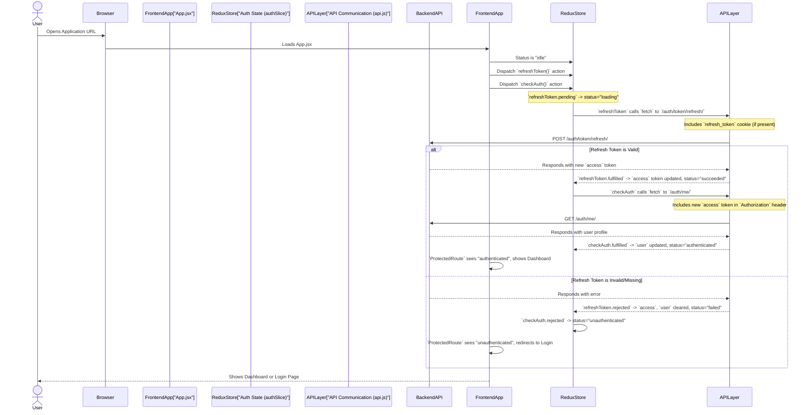

# Chapter 7: Frontend Authentication State Management

Welcome back, frontend architects! In our last chapter, [Chapter 6: API Communication Layer (Frontend)](06_api_communication_layer__frontend__.md), we built our frontend's dedicated "messenger service" (`api.js`). This messenger helps our application talk to the backend, sending login details, fetching user profiles, and refreshing access tokens.

But imagine this: Our messenger successfully talks to the backend, gets a user's name, email, and a special `access` token (like a temporary ID badge). Where does the frontend *keep* this information? How do all the different parts of our application (like the dashboard, profile page, or protected routes) know who the user is and if they're allowed to see certain things?

This is where **"Frontend Authentication State Management"** comes in. It's like having a **front desk manager** for our entire user interface. This manager always knows who is currently "checked in" (logged in), what their name is, and what areas (pages) they are allowed to enter. It keeps this information organized and readily available to every part of our application that needs it.

---

### What Problem Does it Solve?

The main problem this system solves is **making a user's authentication status globally available and consistent** across our entire frontend application.

Without proper state management:
*   Every time a user goes to a new page, we might have to ask the backend again if they're logged in.
*   If a user logs out, we'd have to manually clear their login status from dozens of places.
*   It would be hard to protect certain pages, as each page wouldn't easily know if the user is authenticated.

**Central Use Case:** A user opens our application. Our frontend needs to immediately check if they are already logged in (perhaps from a previous session). If they are, it should show them their dashboard. If not, it should redirect them to the login page. All subsequent interactions (like going to the analytics page or logging out) should correctly reflect their authentication status.

This chapter will show you how we use **Redux** – a popular state management library – to act as our application's reliable front desk manager.

---

### Key Concepts of Frontend Authentication State Management

Our frontend's "front desk manager" (Redux) relies on a few core ideas to keep everything organized:

1.  **Global State (The "Front Desk Registry"):** Instead of each part of our application having its own little copy of user information, we have one central place where *all* important information about the user's login status is stored. This is our "Redux Store."
2.  **`authSlice` (The "Authentication Section"):** Within our global state, we create a specific section dedicated just to authentication. This is called an `authSlice` in Redux Toolkit, and it holds details like:
    *   `user`: The logged-in user's profile information (name, email, ID).
    *   `access`: The temporary `access` token (our short-term ID badge).
    *   `status`: The current state of our authentication process (e.g., "loading", "authenticated", "unauthenticated").
3.  **`useSelector` (Asking the Manager):** Any component in our application can "ask" the front desk manager for information (e.g., "Is there an `access` token?"). `useSelector` is how we do this in React with Redux.
4.  **`useDispatch` & Actions (Telling the Manager to Do Something):** When something happens (e.g., user logs in, logs out, or a token needs refreshing), we "tell" the front desk manager about it. This is done by "dispatching an action." These actions then update the global state.
5.  **`createAsyncThunk` (Complex Operations):** Sometimes, updating the state involves talking to the backend (like logging in or refreshing a token). `createAsyncThunk` in Redux Toolkit helps us manage these multi-step, asynchronous (takes time) operations cleanly.
6.  **Protected Routes (Access Control):** We can use the information from our `authSlice` to guard certain pages. If the front desk manager says the user isn't checked in, they can't enter a "protected" area.

---

### How it Works: The Initial Auth Check (Central Use Case)

Let's walk through our central use case: when the application first loads, how does it check if the user is authenticated?

#### The Initial Authentication Check Flow



This sequence shows that our application immediately tries to use any existing `refresh_token` (from [Chapter 2: User Authentication Flow (Backend)](02_user_authentication_flow__backend__.md)) to get a new `access` token and then fetch user details. This happens before any protected page even loads!

---

### Internal Implementation: The Redux `authSlice`

Our "front desk manager" logic lives primarily in `frontend/src/store/authSlice.js`.

#### 1. The Redux Store Setup (`frontend/src/store/store.js`)

First, we need to create our central `store` where all our application's state will live.

```javascript
// File: frontend/src/store/store.js

import { configureStore } from "@reduxjs/toolkit";
import authReducer from "./authSlice"; // Our auth section of the state

export const store = configureStore({ 
    reducer: { 
        auth: authReducer // We tell the store to use our authReducer for the 'auth' part of the state
    } 
});
```

**Explanation:**
*   `configureStore` creates the main Redux store.
*   `reducer: { auth: authReducer }` tells Redux that any state related to authentication should be managed by the `authReducer` (which we'll define next) and stored under the `auth` key in our global state.

#### 2. The `authSlice` Definition (`frontend/src/store/authSlice.js`)

This is where we define what our authentication state looks like and how it can be changed.

```javascript
// File: frontend/src/store/authSlice.js

import { createSlice, createAsyncThunk } from "@reduxjs/toolkit";
import api from "../api"; // Our API messenger from Chapter 6

// Define the initial state for our authentication information
const initialState = { 
    user: null, 
    access: null, 
    status: "idle", // Can be "idle", "loading", "succeeded", "failed", "authenticated", "unauthenticated"
    error: null 
};

// Create the 'auth' slice
const authSlice = createSlice({
    name: "auth", // This slice is named 'auth'
    initialState, // Use the initialState we defined
    reducers: {
        // Synchronous actions (direct state changes)
        setAccess: (state, action) => {
            state.access = action.payload; // Update the access token
        },
        setUser: (state, action) => {
            state.user = action.payload; // Update the user object
        },
        clearAuth: (state) => {
            state.user = null; // Clear user data
            state.access = null; // Clear access token
            state.status = "unauthenticated"; // Set status to unauthenticated
        },
    },
    // extraReducers handle actions from createAsyncThunk (asynchronous operations)
    extraReducers: (builder) => {
        // ... (see details below for specific async thunks) ...
    },
});

export const { setAccess, setUser, clearAuth } = authSlice.actions; // Export synchronous actions
export default authSlice.reducer; // Export the reducer for the store
```

**Explanation:**
*   `initialState`: This sets up our front desk registry with no user, no access token, and an "idle" status when the app first starts.
*   `createSlice`: This is a Redux Toolkit helper that makes it easy to define a "slice" of our global state.
*   `reducers`: These are functions that directly change our state. `setAccess` and `setUser` allow us to put information into the state, and `clearAuth` empties it.
*   `extraReducers`: This special section handles actions that come from our asynchronous operations (`createAsyncThunk`), which we'll look at next.

#### 3. Asynchronous Actions (`createAsyncThunk`)

These are the functions that talk to our backend (using `api.js` or `fetch`) and then trigger updates to our `authSlice`.

##### a. `refreshToken`: Getting a new `access` token

```javascript
// File: frontend/src/store/authSlice.js (snippet, inside authSlice.js)

export const refreshToken = createAsyncThunk("auth/refresh", async () => {
    const apiUrl = import.meta.env.VITE_API_URL || "http://localhost:8000/api";
    const res = await fetch(apiUrl + "/auth/token/refresh/", {
        method: "POST",
        credentials: "include", // ESSENTIAL for sending the HttpOnly refresh_token cookie
    });
    if (!res.ok) {
        const txt = await res.text();
        throw new Error(txt || "Refresh failed");
    }
    const data = await res.json();
    return data.access; // Returns the new access token
});

// Inside extraReducers:
// ...
builder.addCase(refreshToken.pending, (state) => {
    state.status = "loading"; // When refresh starts, status is "loading"
});
builder.addCase(refreshToken.fulfilled, (state, action) => {
    state.status = "succeeded"; // When successful, status is "succeeded"
    state.access = action.payload; // Store the new access token
});
builder.addCase(refreshToken.rejected, (state, action) => {
    state.status = "failed"; // If refresh fails
    state.access = null;     // Clear access token
    state.user = null;       // Clear user (as they are no longer authenticated)
});
// ...
```

**Explanation:**
*   `createAsyncThunk("auth/refresh", ...)`: This defines an action that refreshes our access token.
*   It uses `fetch` directly (as seen in [Chapter 6: API Communication Layer (Frontend)](06_api_communication_layer__frontend__.md)) and critically includes `credentials: "include"` to send the `refresh_token` cookie to the backend.
*   `extraReducers` for `refreshToken`: These are special reducers that automatically run based on the `pending` (started), `fulfilled` (succeeded), or `rejected` (failed) status of our `refreshToken` async thunk. They update the `status` and `access` fields in our state.

##### b. `loginUser`: Logging in with credentials

```javascript
// File: frontend/src/store/authSlice.js (snippet, inside authSlice.js)

export const loginUser = createAsyncThunk("auth/login", async (credentials) => {
    // Uses our API messenger from Chapter 6
    const res = await api.post("/auth/login/", credentials); 
    return res; // Returns {access, refresh, user} from backend
});

// Inside extraReducers:
// ...
builder.addCase(loginUser.fulfilled, (state, action) => {
    const res = action.payload;
    state.access = res.access; // Store the new access token
    state.user = res.user;     // Store the user profile
    state.status = "authenticated"; // User is now authenticated
});
// ...
```

**Explanation:**
*   `loginUser` is dispatched when a user submits the login form.
*   It uses `api.post` (our messenger from [Chapter 6](06_api_communication_layer__frontend__.md)) to send credentials to the backend.
*   If successful, `loginUser.fulfilled` updates the `access` token, `user` object, and sets the `status` to "authenticated."

##### c. `logoutAsync`: Logging out

```javascript
// File: frontend/src/store/authSlice.js (snippet, inside authSlice.js)

export const logoutAsync = createAsyncThunk("auth/logout", async () => {
    const apiUrl = import.meta.env.VITE_API_URL || "http://localhost:8000/api";
    await fetch(apiUrl + "/auth/logout/", {
        method: "POST",
        credentials: "include", // Sends refresh_token cookie for deletion
    });
    return true; // Just a signal that logout attempt was made
});

// Inside extraReducers:
// ...
builder.addCase(logoutAsync.fulfilled, (state) => {
    state.user = null;     // Clear user data
    state.access = null;   // Clear access token
    state.status = "unauthenticated"; // Set status to unauthenticated
});
// ...
```

**Explanation:**
*   `logoutAsync` is dispatched when a user clicks "Logout."
*   It calls the backend's `/auth/logout/` endpoint, which tells the backend to delete the `refresh_token` cookie (as discussed in [Chapter 2: User Authentication Flow (Backend)](02_user_authentication_flow__backend__.md)).
*   `logoutAsync.fulfilled` then clears the user's data and token in our local state.

##### d. `checkAuth`: Initial Authentication Check

```javascript
// File: frontend/src/store/authSlice.js (snippet, inside authSlice.js)

export const checkAuth = createAsyncThunk("auth/checkAuth", async () => {
    const apiUrl = import.meta.env.VITE_API_URL || "http://localhost:8000/api";
    const res = await fetch(apiUrl + "/auth/token/refresh/", {
        method: "POST",
        credentials: "include",
    });
    if (res.ok) { // If refresh token was successful (got a new access token)
        const data = await res.json();
        // Now use the new access token to fetch the user's profile
        const userRes = await fetch(apiUrl + "/auth/me/", {
            method: "GET",
            credentials: "include", // Still include cookies for good measure
            headers: {
                Authorization: `Bearer ${data.access}`, // Send the new access token
            },
        });
        const user = await userRes.json();
        return { access: data.access, user }; // Return both token and user
    } 
    else {
        throw new Error("Not authenticated"); // If refresh failed, user is not authenticated
    }
});

// Inside extraReducers:
// ...
builder.addCase(checkAuth.fulfilled, (state, action) =>{
    state.user = action.payload.user;       // Set user profile
    state.access = action.payload.access;   // Set access token
    state.status = "authenticated";         // User is authenticated!
}).addCase(checkAuth.rejected, (state) => {
    state.user = null;                     // Clear user data
    state.access = null;                   // Clear access token
    state.status = "unauthenticated";      // User is not authenticated
});
// ...
```

**Explanation:**
*   `checkAuth` is called when the application first loads.
*   It first attempts to refresh the `access` token using the `refresh_token` cookie.
*   If that succeeds, it *then* uses the newly obtained `access` token to fetch the user's profile from the backend's `/auth/me/` endpoint (as discussed in [Chapter 2: User Authentication Flow (Backend)](02_user_authentication_flow__backend__.md)).
*   `checkAuth.fulfilled` updates both `user` and `access` and sets `status` to "authenticated".
*   If anything in this process fails, `checkAuth.rejected` ensures the state is cleared, and `status` is set to "unauthenticated".

---

#### 4. Using the Authentication State in Components

Now that our Redux store is set up as our front desk manager, let's see how different parts of our application interact with it.

##### a. Initial Application Load (`frontend/src/App.jsx`)

When our application first starts, `App.jsx` tells our front desk manager (Redux) to perform the initial authentication check.

```javascript
// File: frontend/src/App.jsx

import {
    BrowserRouter as Router, Routes, Route, Navigate,
} from "react-router-dom";
import { useDispatch, useSelector } from "react-redux"; // Import Redux hooks
import { useEffect } from "react";
import { refreshToken, checkAuth } from "./store/authSlice"; // Import our auth actions
// ... other imports ...
import ProtectedRoute from "./components/ProtectedRoute"; // Our route protector

export default function App() {
    const dispatch = useDispatch(); // To tell the Redux manager to do things
    const { status } = useSelector((state) => state.auth); // To ask the manager for the status

    useEffect(() => {
        // When the app first loads, dispatch these actions
        dispatch(refreshToken()); // Try to get a new access token
        dispatch(checkAuth());    // Then check full authentication status
    }, [dispatch]); // Only run once when component mounts

    if(status == "idle") {
        return <div className="text-center mt-10 text-white">Loading...</div>;
    }

    return (
        <Router>
            <Routes>
                {/* ... other routes ... */}
                <Route
                    path="/dashboard"
                    element={
                        <ProtectedRoute> {/* This route is protected! */}
                            <Dashboard />
                        </ProtectedRoute>
                    }
                />
                <Route
                    path="/analytics"
                    element={
                        <ProtectedRoute> {/* This one too! */}
                            <AnalyticsPage />
                        </ProtectedRoute>
                    }
                />
            </Routes>
        </Router>
    );
}
```

**Explanation:**
*   `useDispatch()`: Gives us a function to send actions to our Redux store.
*   `useSelector(...)`: Allows us to read specific parts of our Redux state, in this case, the `status` from our `auth` slice.
*   `useEffect(() => { ... }, [dispatch])`: This code runs once when the `App` component first appears. It dispatches `refreshToken()` and `checkAuth()` to kick off the authentication process.
*   `if(status == "idle")`: While `refreshToken` and `checkAuth` are working, the `status` will be "loading" or "idle", so we show a "Loading..." message to the user.

##### b. Protecting Routes (`frontend/src/components/ProtectedRoute.jsx`)

This component acts as a guard. It uses `useSelector` to check the authentication state and only allows access to its children (the actual page components) if the user is authenticated.

```javascript
// File: frontend/src/components/ProtectedRoute.jsx

import { useSelector } from "react-redux"; // To read the state
import { Navigate } from "react-router-dom"; // To redirect users
import Spinner from "./Spinner"; // A loading spinner

export default function ProtectedRoute({ children }) {
    // Ask the Redux manager for the access token and status
    const { access, status } = useSelector((s) => s.auth); 
    
    // If we're still loading AND don't have an access token yet, show a spinner
    if (status === "loading" && !access)
        return (
            <div className="h-screen flex items-center justify-center">
                <Spinner />
            </div>
        );
    
    // If there's no access token, redirect to the login page
    if (!access) return <Navigate to="/login" replace />;
    
    // Otherwise, the user is authenticated, so show the content
    return children;
}
```

**Explanation:**
*   `const { access, status } = useSelector((s) => s.auth);`: The `ProtectedRoute` asks our front desk manager (Redux) for the current `access` token and `status`.
*   `if (status === "loading" && !access)`: If the initial `checkAuth` is still running and we don't have an `access` token yet, we show a loading spinner.
*   `if (!access) return <Navigate to="/login" replace />;`: If there's no `access` token (meaning the user isn't authenticated), this component redirects them to the `/login` page, effectively blocking access to the protected content.
*   `return children;`: If an `access` token exists, the user is logged in, and the `ProtectedRoute` allows the `children` (e.g., `Dashboard` or `AnalyticsPage`) to be displayed.

---

### Summary of Frontend Authentication State

Here's a quick look at the key pieces of information our "front desk manager" stores:

| State Variable | Type    | Purpose                                                                 | How it's Updated                                                      |
| :------------- | :------ | :---------------------------------------------------------------------- | :-------------------------------------------------------------------- |
| `user`         | Object  | Stores the logged-in user's profile data (ID, username, email).         | `loginUser.fulfilled`, `checkAuth.fulfilled`                          |
| `access`       | String  | The JWT access token, used to authenticate requests to the backend.       | `loginUser.fulfilled`, `refreshToken.fulfilled`, `checkAuth.fulfilled`|
| `status`       | String  | Indicates the current authentication process state ("idle", "loading", "succeeded", "failed", "authenticated", "unauthenticated"). | `refreshToken`, `checkAuth` async thunks (pending, fulfilled, rejected) |
| `error`        | String  | (Optional) Stores any error messages related to authentication.         | `refreshToken`, `loginUser`, `checkAuth` async thunks (rejected)      |

---

### Conclusion

In this chapter, we've explored **Frontend Authentication State Management**, setting up Redux as our application's central front desk manager. We learned:

*   How a global **Redux store**, specifically an `authSlice`, acts as the single source of truth for our user's authentication status.
*   How **`createAsyncThunk`** actions (`refreshToken`, `loginUser`, `checkAuth`, `logoutAsync`) handle complex, asynchronous interactions with our backend.
*   How **`useSelector`** allows any component to "ask" the manager for authentication information.
*   How **`useDispatch`** allows components to "tell" the manager to perform authentication actions.
*   How **`ProtectedRoute`** components use this state to intelligently control access to sensitive areas of our application, redirecting unauthenticated users to the login page.

This Redux-based system ensures that our frontend always knows the user's login status, making our application responsive, secure, and user-friendly.

---

<sub><sup>Written by [Devesh](https://github.com/devesh111).</sup></sub> <sub><sup>**References**: [[1]](https://github.com/devesh111/Complete-User-Authentication/blob/be7caf6a301c77116064d4b37322e7e9673afa30/frontend/src/App.jsx), [[2]](https://github.com/devesh111/Complete-User-Authentication/blob/be7caf6a301c77116064d4b37322e7e9673afa30/frontend/src/components/ProtectedRoute.jsx), [[3]](https://github.com/devesh111/Complete-User-Authentication/blob/be7caf6a301c77116064d4b37322e7e9673afa30/frontend/src/store/authSlice.js), [[4]](https://github.com/devesh111/Complete-User-Authentication/blob/be7caf6a301c77116064d4b37322e7e9673afa30/frontend/src/store/store.js)</sup></sub>