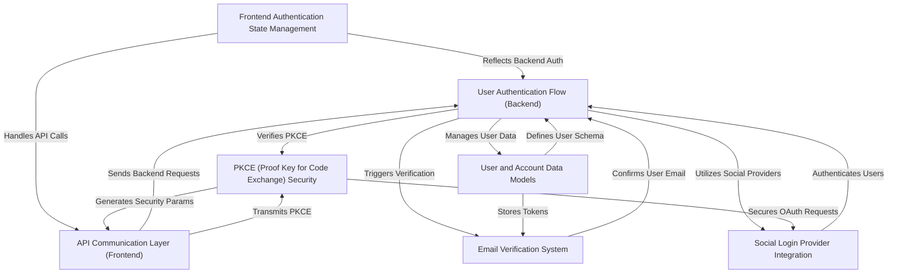

# Tutorial: Complete-User-Authentication

This project offers a *complete user authentication system* for both traditional email/password and *social logins* (Google, GitHub, etc.). It features **email verification** for new accounts and uses **secure tokens** to manage user sessions across the frontend and backend.

## Visual Overview

## Chapters

1. [User and Account Data Models
](01_user_and_account_data_models_.md)
2. [User Authentication Flow (Backend)
](02_user_authentication_flow__backend__.md)
3. [Social Login Provider Integration
](03_social_login_provider_integration_.md)
4. [Email Verification System
](04_email_verification_system_.md)
5. [PKCE (Proof Key for Code Exchange) Security
](05_pkce__proof_key_for_code_exchange__security_.md)
6. [API Communication Layer (Frontend)
](06_api_communication_layer__frontend__.md)
7. [Frontend Authentication State Management
](07_frontend_authentication_state_management_.md)

---

Written by [Devesh](https://github.com/devesh111).